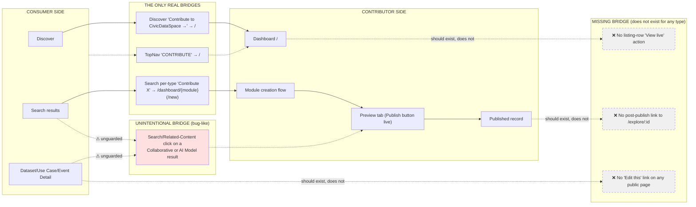

# CivicDataSpace — Current Prototype IA & Navigation Audit

**Date:** 2026-09-30
**Scope:** Reverse-engineered from the implementation as it exists today (post-PR #39). No redesign recommendations are included — this is a factual map of what exists, per the audit brief's rules.
**Method:** Direct code inspection (routes, layout logic, nav configs, page components, type definitions, `AppDataContext`). Every claim below is traceable to a specific file and line. Anything that could not be confirmed from code is marked **Unknown / Needs validation**.

---

## 1. Executive Summary

CivicDataSpace's prototype has a clean *component* architecture (shared `ManagementTable`, shared `ContentCard`/`SearchResultCard`, a consistent design system) but an **inconsistent and partially incomplete information architecture** underneath it. Four findings dominate everything else in this audit:

1. **There is no authentication.** The "Log In / Sign Up" control in the top nav is local component state (`useState(false)` in `TopNav.tsx`) that resets on every page load and is read nowhere else in the app. No route is guarded. Anyone can type any `/dashboard/*` or `/organisations/:id/*` URL and land on it directly. The three `/auth/*` pages exist, look complete, and do nothing — they navigate to `/` on "success" without creating any session.
2. **Only 3 of 7 content types have a real public detail page.** Dataset, Use Case, and Event get genuine `/explore/:id` consumer pages with a `status === 'published'` gate. Collaborative, AI Model, and Publication have **no consumer route at all** — the link that Search, Discover, and Event Related Content give a visitor for these types points straight at the *contributor's own pre-publish preview page* (`/dashboard/collaboratives/:id/preview`, `/dashboard/ai-models/:id/preview`), which has **no publish-status gate** (drafts are fully visible) and displays a live "Publish" button to anyone who opens the link. Chart has no public page by design (it only appears embedded in its parent Dataset's page).
3. **Publishing something never tells the contributor how to see it live.** Across all seven content types, zero row actions, zero post-publish success screens, and zero preview-page buttons link to the actual `/explore/...` URL. The closest thing ("View X") either re-scrolls the same ephemeral preview tab or navigates back into the contributor's own editor.
4. **The public "Explore" section is mostly stubs.** Only Use Cases have a working `/explore/use-cases` listing grid. Datasets, Events, AI Models, Publications, and Collaboratives all show a literal "coming soon" placeholder at their would-be listing route — despite Datasets, Events, and (nominally) Collaboratives having fully wired detail pages and publish flows underneath.

The platform currently reads as **two separately-built products stitched together**: a consumer content site (Discover/Search/Explore) and a contributor CMS (My Workspace/Organisation Workspace), sharing one top nav and breadcrumb system but with very little deliberate connective tissue between them, and a fair number of implementation gaps (missing routes, non-functional decorative links, unpublished drafts publicly viewable) that look like navigation bugs a designer should know about before touching the IA.

---

## 2. Application Structure

- **Framework:** React 19 + React Router, single-page app, one route tree in `src/App.tsx`.
- **Two independent `<Routes>` blocks** inside one `AppLayout()` function, switched by `isAuthRoute = location.pathname.startsWith('/auth/')` (`App.tsx:114`):
  - **Auth block** (`App.tsx:118-122`): renders only `<SignInPage>`, `<RegisterPage>`, `<ForgotPasswordPage>` inside their own `AuthLayout` — no shared chrome (no TopNav, sidebar, breadcrumb, or footer).
  - **Main block** (`App.tsx:153-199`): every other route, wrapped in shared chrome: `<TopNav>` (always) → conditional `<BreadcrumbBar>` → conditional sidebar (`OrganisationSidebar` / `ContributorSidebar` / none) + routed page content → `<Footer>` (always) → conditional `<HelpButton>` (dashboard root only).
- **Layout decisions are computed once per render from `location.pathname`**, not from any auth/user state (`App.tsx:87-113`):
  ```ts
  const isDashboard = pathname === '/'
  const isUseCasePreview / isCollaborativePreview / isAIModelPreview / isEventPreview / isPublicationPreview =
    /^\/dashboard\/(use-cases|collaboratives|ai-models|events|publications)\/[^/]+\/preview$/
  const isDesignSystem = pathname === '/design-system'
  const isConsumerRoute = pathname.startsWith('/explore/') || pathname in {'/collaboratives','/forum','/discover','/search'}
  const isOrganisationSelector = pathname === '/organisations'
  const organisationWorkspaceId = /^\/organisations\/([^/]+)/.exec(pathname)?.[1]
  const hideSidebar = isDashboard || any-preview || isDesignSystem || isConsumerRoute || isOrganisationSelector
  ```
- **Sidebar selection** (`App.tsx:147-150`): no sidebar if `hideSidebar`; else `OrganisationSidebar` if inside `/organisations/:id/...`; else `ContributorSidebar` (personal "My Workspace").
- **Consumer-route chrome**: `isConsumerRoute` pages get `bg-background` (white canvas) on the outer wrapper, `<main>`, and `<Footer>`, explicitly to visually distinguish Explore/Search/Discover/Collaboratives/Forum from the app's default grey dashboard background (`App.tsx:127,136-145,203`, comment at 139-143).
- **BreadcrumbBar** is suppressed only on the five `*/preview` routes (`App.tsx:129-133`) — shown everywhere else, including the dashboard root and every consumer route.
- **`HelpButton`** renders only on `/` (`App.tsx:205`).
- No route-level component wraps anything in an auth guard. No 404 page component exists; the catch-all route silently redirects unknown paths to `/dashboard/datasets` (`App.tsx:198`).

---

## 3. Complete Sitemap

### 3.1 Auth pages (no shared chrome — separate `AuthLayout`)

| Page | Route | User state | Page type | Entry points | Exit paths | Primary action | Notes |
|---|---|---|---|---|---|---|---|
| Sign In | `/auth/sign-in` | Anonymous | Auth | Typed URL; links from Register/Forgot-password pages; `DeleteAccountDialog` after account deletion | `/` on success (no session created) | Submit email+password or "Continue with Google" | Only one hardcoded credential pair ever succeeds (`MOCK_EXISTING_USER` in `auth-mock.ts`). No auth CTA elsewhere in the app links here (see §8). |
| Register | `/auth/register` | Anonymous | Auth | Typed URL; link from Sign In | `/` after a fake "account created" screen | Submit registration form | Never persists an account anywhere. |
| Forgot Password | `/auth/forgot-password` | Anonymous | Auth | Typed URL; link from Sign In | Back to `/auth/sign-in` | Submit email | No email is sent; just shows a "sent" state. |

### 3.2 Public / Consumer-facing pages

| Page | Route | User state | Content type | Page type | Entry points | Exit paths | Primary action | Nav context | Back behavior | Notes |
|---|---|---|---|---|---|---|---|---|---|---|
| Discover | `/discover` | Anonymous/any | — | Landing | Logo click (any page); direct nav | Contribute CTA → `/`; category cards → `/search?type=X` | Browse categories / search | Global nav (logo target) | N/A (landing) | No dedicated "Home" other than this. |
| Search Results | `/search` | Anonymous/any | Dataset, Use Case, Collaborative, Event, Publication (as event sub-item), AI Model | Listing | TopNav search icon; Discover category cards; breadcrumb links from several detail pages | Content-type-specific detail/preview pages | Search, filter, sort, switch type tab | Global (search icon) | Search-icon toggle closes back to prior page | The only true cross-content listing surface in the app. |
| Use Cases Explore | `/explore/use-cases` | Anonymous/any | Use Case | Listing | Breadcrumb "Use Cases" only from an old link; not linked from TopNav | `/explore/use-cases/:id` | Browse published use cases | Local (page-level grid) | Browser back | **The only content type with a real dedicated Explore listing.** |
| Dataset Detail | `/explore/datasets/:id` | Anonymous/any | Dataset | Detail | Search results; Use Case's "Datasets behind this story" links; direct URL | None outward (no related-content section) | Read Overview/Data/Visualisations tabs | None (detail page) | `useGoBack('/explore/datasets')` | Fallback destination if no browser history is a `ComingSoonPage` (no listing exists at `/explore/datasets`). No related-content, no outbound cross-links to other content types. |
| Use Case Detail | `/explore/use-cases/:id` | Anonymous/any | Use Case | Detail | Search results; `/explore/use-cases` grid; Event Related Content | Linked Datasets (`/explore/datasets/:id`) | Read story, view linked dashboard | None | `useGoBack('/search?type=use-case')` | Reuses the exact same `UseCasePreview` component as the contributor's own preview page. |
| Event Detail | `/explore/events/:id` | Anonymous/any | Event | Detail | Search results; direct URL | Related Content cards (Datasets, Use Cases — real; Collaboratives/AI Models — land in `/dashboard/...`, see §9) | Read event info, register/join, browse related content | None | `useGoBack('/explore/events')` | Fallback if no history is a `ComingSoonPage` (`/explore/events` has no listing). Richest related-content implementation of any detail page. |
| Collaboratives (public) | `/collaboratives` | Anonymous/any | Collaborative | Landing/stub | TopNav "COLLABORATIVES" | None (stub) | None | Global nav | N/A | **`ComingSoonPage` placeholder** — the TopNav's primary "Collaboratives" destination does not exist yet. |
| Forum | `/forum` | Anonymous/any | — | Landing/stub | TopNav "FORUM" | None (stub) | None | Global nav | N/A | `ComingSoonPage` placeholder. |
| Datasets Explore (stub) | `/explore/datasets` | Anonymous/any | Dataset | Listing/stub | Breadcrumb "Datasets" link | None | None | Breadcrumb only | N/A | `ComingSoonPage`; Datasets are only really browsable via `/search`. |
| AI Models Explore (stub) | `/explore/ai-models` | Anonymous/any | AI Model | Listing/stub | Breadcrumb link | None | None | Breadcrumb only | N/A | `ComingSoonPage`. |
| Publications Explore (stub) | `/explore/publications` | Anonymous/any | Publication | Listing/stub | Breadcrumb link | None | None | Breadcrumb only | N/A | `ComingSoonPage`; Publications also don't exist as standalone search results (see §12). |
| Events Explore (stub) | `/explore/events` | Anonymous/any | Event | Listing/stub | Breadcrumb link | None | None | Breadcrumb only | N/A | `ComingSoonPage` — also the `useGoBack` fallback destination for Event Detail. |

### 3.3 Contributor pages (personal "My Workspace")

All routes below render `<ContributorSidebar>` (nav groups: **Contribution** [Datasets, Use Cases, Collaboratives, AI Models, Publications, Charts, Events], **Account** [Profile], **More** [Help & Support]) and are reachable at any time by URL, with no login requirement.

| Page | Route | Page type | Entry points | Exit paths | Primary action | Notes |
|---|---|---|---|---|---|---|
| Dashboard | `/` | Dashboard | TopNav "CONTRIBUTE"; TopNav logo→Discover but UserMenu "Dashboard"→`/`; Sidebar "Dashboard" back-link | Any Contribution item; `/organisations` | Jump into "Continue working" items (drafts / items with unpublished edits) | Only route with `<HelpButton>`; no sidebar shown here (`isDashboard` hides it). |
| Datasets list | `/dashboard/datasets` | Listing (view-state, not a route change) | Sidebar; Dashboard "Continue working" | Create/Edit flow (same page, different internal view) | Create, edit, publish, unpublish, delete | Not a separate creation route — `DatasetsPage` toggles an internal `list`/`create` view. |
| Dataset creation/edit | (same route, `view=create`) | Create/Edit | Datasets list | Publish → success modal; Save draft → stays | Save as Draft / Publish | 3 steps: Data Files → Metadata → Review & Publish. No separate preview page exists — Step 3 doubles as review. |
| Use Cases list | `/dashboard/use-cases` | Listing | Sidebar | `/dashboard/use-cases/new` | Create, edit, publish, unpublish, delete | |
| Use Case creation | `/dashboard/use-cases/new` | Create/Edit | Use Cases list | Preview (new tab) → `/dashboard/use-cases/:id/preview` | Save draft / Preview / Publish | |
| Use Case preview | `/dashboard/use-cases/:id/preview` | Preview | Creation flow (new tab) | Back to editor (closes tab); "Continue to Manage" → list | Publish | Same component as the real public detail page. |
| Collaboratives list | `/dashboard/collaboratives` | Listing | Sidebar | `/dashboard/collaboratives/new` | Create, edit, publish, unpublish, delete | |
| Collaborative creation | `/dashboard/collaboratives/new` | Create/Edit | Collaboratives list | Preview (new tab) | Save draft / Preview / Publish | 4 steps: About → People & Orgs → Content → Review & Publish. |
| Collaborative preview | `/dashboard/collaboratives/:id/preview` | Preview **and** the only "public" page this content type has | Creation flow; **Search results; Event Related Content (as a consumer!)** | "← Back to Editor"; "Back to Dashboard" | Publish | **No published-status gate — drafts fully viewable; Publish button shown to any visitor.** See §9, §16. |
| AI Models list | `/dashboard/ai-models` | Listing | Sidebar | `/dashboard/ai-models/new` | Create, edit, publish, unpublish, delete | |
| AI Model creation | `/dashboard/ai-models/new` | Create/Edit | AI Models list | Preview (new tab) | Save draft / Preview / Publish | |
| AI Model preview | `/dashboard/ai-models/:id/preview` | Preview **and** the only "public" page this content type has | Creation flow; **Search results; Event Related Content (as a consumer!)** | "← Back to Editor"; "Back to AI Models" | Publish | Same gap as Collaborative. |
| Publications list | `/dashboard/publications` | Listing | Sidebar | `/dashboard/publications/new` | Create, edit, publish, unpublish, delete | |
| Publication creation | `/dashboard/publications/new` | Create/Edit | Publications list | Preview (new tab) | Save draft / Preview / Publish | |
| Publication preview | `/dashboard/publications/:id/preview` | Preview | Creation flow only — **not linked from any consumer surface** | "← Back to Editor"; "Back to Publications" | Publish | Publications are represented in Search only as sub-items of their parent Event. |
| Charts list | `/dashboard/charts` | Listing | Sidebar | `/dashboard/charts/new` | Create, edit, delete (no unpublish row action documented beyond the generic pattern) | |
| Chart creation | `/dashboard/charts/new` | Create/Edit | Charts list | Publish → success modal | Save draft / Publish | 3 steps: Dataset → Create → Review & Publish. **No preview page/route exists at all** — the only content type published fully in-page. |
| Events list | `/dashboard/events` | Listing | Sidebar | `/dashboard/events/new` | Create, edit, publish, unpublish, delete | |
| Event creation | `/dashboard/events/new` | Create/Edit | Events list | Preview (new tab) | Save draft / Preview / Publish | 4 steps: Details → Connections → Resources → Review & Publish. |
| Event preview | `/dashboard/events/:id/preview` | Preview | Creation flow (new tab) | Back to editor; "Continue to Manage" → list | Publish | **Structurally unrelated to the real `EventDetailPage`** — zero shared components (see §10). |
| Profile | `/dashboard/profile` | Dashboard/settings | Sidebar "Account" group | — | Edit personal profile fields | |

### 3.4 Contributor pages (Organisation Workspace)

Mirrors the personal workspace module-for-module, scoped under `/organisations/:organisationId/...`, rendering `<OrganisationSidebar>` instead (nav groups: **Overview** [Dashboard], **Contribution** [same 7 types], **Organisation** [Admin & Members, Profile]).

| Page | Route | Notes |
|---|---|---|
| Organisation selector | `/organisations` | Lists orgs the current mock user (`personId: 'me'`) belongs to; "Create Organisation" side-sheet auto-navigates into the new org on success. |
| Organisation Dashboard | `/organisations/:organisationId` | Root/overview for the org workspace. |
| Org Datasets / Publications / Use Cases / AI Models / Collaboratives / Charts / Events | `/organisations/:organisationId/{module}` | Same listing pattern as personal workspace, scoped to org-tagged records. |
| Admin & Members | `/organisations/:organisationId/members` | Member list + role management (Admin/Editor/Evaluator) + Invitations tab. |
| Organisation Profile | `/organisations/:organisationId/profile` | Org metadata (logo, description, social links, etc.) |

**Note:** creation/preview flows for org-scoped content reuse the *same* `/dashboard/.../new` and `/dashboard/.../:id/preview` routes as personal content — organisation attribution is passed via `organisationId` in navigation state, not a separate `/organisations/:id/.../new` route. This is a deliberate reuse, but it also means the URL for "creating a dataset on behalf of an org" is identical to "creating a personal dataset" — the only differentiator is in-page context (an `OrganisationContextBanner`), not the URL.

### 3.5 Shared / System / Utility pages

| Page | Route | Notes |
|---|---|---|
| Design System | `/design-system` | Internal component reference; no sidebar. |
| (implicit 404) | any unmatched path | `<Navigate to="/dashboard/datasets" replace />` — no dedicated NotFound page/component exists anywhere in the codebase. |
| Coming Soon (reused) | `/explore/datasets`, `/explore/ai-models`, `/explore/publications`, `/explore/events`, `/collaboratives`, `/forum` | One shared `ComingSoonPage` component parameterized by `title`, used as a placeholder for 6 different routes. |

---

## 4. Global Navigation Audit

### TopNav (`src/components/layout/TopNav.tsx`) — rendered on every non-auth route

```text
Label: [CivicDataSpace logo]
Destination: /discover
Route: any (global header)
Visible when: always (all non-auth routes)
Hidden when: /auth/*
User state: any
Purpose: brand home / "start over" anchor
Other ways to reach same destination: none — this is the only link to /discover in the whole app besides typing the URL
```
```text
Label: COLLABORATIVES
Destination: /collaboratives
Visible when: always
User state: any
Purpose: intended top-level entry to the Collaboratives section
Other ways to reach same destination: Discover page has no Collaborative card; Search has a "collaborative" type filter that leads to a *different* destination (dashboard preview route) than this nav item (a ComingSoonPage) — see §11.
```
```text
Label: FORUM
Destination: /forum
Visible when: always
User state: any
Purpose: intended community/discussion section
Other ways to reach same destination: none
```
```text
Label: CONTRIBUTE
Destination: / (Dashboard)
Visible when: always
User state: any
Purpose: primary consumer→contributor bridge
Other ways to reach same destination: Discover page's "Contribute to CivicDataSpace →" CTA; Search results' per-type "Contribute X" CTAs (which go to more specific `/dashboard/...` routes, not just `/`)
```
```text
Label: [search icon]
Destination: /search (toggles closed if already there)
Visible when: always
User state: any
Purpose: global search entry point
Other ways to reach same destination: Discover page has its own embedded search field that also lands on /search
```
```text
Label: "Log In / Sign Up" (AuthButton) — logged-out state
Destination: none (does NOT navigate to /auth/sign-in — just flips local isLoggedIn=true)
Visible when: local isLoggedIn === false (resets on every reload)
User state: "anonymous" per local state only
Purpose: appears to be an auth entry point but is disconnected from the real /auth/* pages
Other ways to reach same destination: N/A — there is no other "Log In" affordance anywhere in the app; /auth/sign-in itself is only reachable by typed URL or from Register/Forgot-password internal links
```
```text
Label: UserMenu (avatar "JD") → "Dashboard" — logged-in state
Destination: /
Visible when: local isLoggedIn === true
User state: "logged in" per local state only
Purpose: quick return to personal dashboard
Other ways to reach same destination: logo does NOT go here (goes to /discover instead); Sidebar's own back-link when inside Contribution pages also returns to /
```
```text
Label: UserMenu → "Sign out"
Destination: none (flips isLoggedIn back to false, stays on current page)
Visible when: local isLoggedIn === true
Purpose: cosmetic sign-out
```

**Duplicate-destination note:** "Contribute" (TopNav, global, always visible) and "Contribute Dataset/Use Case/Publication/AI Model" (Search results, contextual, type-filtered) both exist simultaneously and go to different granularities of the same idea — worth flagging as either intentional progressive disclosure or redundant IA (see §11).

### Sidebar navigation

**Personal "My Workspace"** (`nav-config.ts`) — group **Contribution**: Datasets, Use Cases, Collaboratives, AI Models, Publications, Charts, Events (all `/dashboard/{module}`); group **Account**: Profile (`/dashboard/profile`); group **More**: Help & Support (opens a panel, not a route).

**Organisation Workspace** (`organisation-nav-config.ts`) — group **Overview**: Dashboard (`/organisations/:id`, exact-match only); group **Contribution**: identical 7 modules scoped to `/organisations/:id/{module}`; group **Organisation**: Admin & Members, Profile. No "Account"/"More"/Help group exists on the org sidebar.

Both sidebars share one component (`ContributorSidebar`) with: collapse/expand (persisted to `localStorage`, default expanded 232px / collapsed 80px), an identity block (photo/logo + name + role), and a bottom "back" link — `"Dashboard" → /` for personal, `"Switch organisation" → /organisations` for org workspace.

### Breadcrumbs

Not a static per-page config — a cascading sequence of pathname-pattern checks in `BreadcrumbBar.tsx` (Discover exact match → dataset/use-case/event detail patterns → Explore-listing label map → consumer-page label map → `/organisations` exact → org-route regex reusing the org nav config → fallback reusing the personal nav config). Every trail is prefixed `Home →`. Examples:

- `/explore/datasets/ds-1` → `Home › Explore › Datasets › <Dataset Name>`
- `/organisations/org-1/datasets` → `Home › Dashboard › My Organisations › <Org Name> › Datasets`
- `/search` → `Home › Search`
- `/dashboard/datasets` → `Home › Dashboard › My Workspace › Datasets`

### Back-navigation

`useGoBack(fallback)` (`src/hooks/use-go-back.ts`): uses real `history.back()` if any history exists, else navigates to a hardcoded fallback. **Only 3 pages in the entire app use it**: Dataset Detail (fallback `/explore/datasets`, itself a stub), Use Case Detail (fallback `/search?type=use-case`), Event Detail (fallback `/explore/events`, itself a stub). No contributor page uses this hook — contributor "back" is always a hardcoded `<Link>`/`navigate()` to a specific list route.

### Global search

One entry point (TopNav icon, available everywhere), one results surface (`/search`), covering 6 content types via `buildSearchIndex()` — Dataset, Use Case, Collaborative, Event, AI Model (each independently indexed, published-only) plus Publication (indexed only as a nested sub-item of its parent Event, never standalone). Grouped by type-filter chips (All/Datasets/Use Cases/Publications/Collaboratives/Events/AI Models), sortable (Relevance/Newest/Oldest/A–Z), List/Grid toggle. Filters vary per type (sector, geography, format, license, recency, etc.), AND-across-groups/OR-within-group.

**Critical inconsistency:** result destinations are not uniform —
- Dataset → `/explore/datasets/:id` (real public page)
- Use Case → `/explore/use-cases/:id` (real public page)
- Event → `/explore/events/:id` (real public page)
- Publication → parent Event's `/explore/events/:id` (no standalone page)
- Collaborative → `/dashboard/collaboratives/:id/preview` (**contributor tool**)
- AI Model → `/dashboard/ai-models/:id/preview` (**contributor tool**)

### Related-content / cross-content navigation

Only **Event Detail** has a fully wired related-content section, and it deliberately reuses the same search index and the same `SearchResultCard` component Search itself uses — so clicking a related item follows the *exact same* (inconsistent, see above) destination rules as a search result. Use Case Detail has one real outbound link type (to related Datasets). Dataset Detail has **no** outbound related-content links at all. Collaborative's "related datasets/use cases" list is rendered as plain non-interactive text — it looks like links but isn't (see §16).

---

## 5. Consumer IA

**Start:** `/discover` (reached via the logo from anywhere, or as a direct landing URL).

**Confirmed implemented paths:**
```text
Discover → Search (via category card, e.g. "Datasets" → /search?type=dataset)
Discover → Search (via embedded search field)
Discover → Contribute CTA → / (Dashboard)
Search → Dataset Detail | Use Case Detail | Event Detail (real pages)
Search → Collaborative Preview | AI Model Preview (contributor tool, not a real public page)
Search → parent Event page (for a Publication result)
Use Cases Explore grid → Use Case Detail
Use Case Detail → Dataset Detail (related datasets)
Event Detail → Dataset Detail | Use Case Detail | Collaborative Preview | AI Model Preview | parent-Event-again (Related Content, mixed destinations)
Dataset Detail → (dead end — no outbound content links, only a tag→Search link and an external publisher URL)
```

**Per-journey answers:**
- **Is the transition obvious?** Yes for Dataset/Use Case/Event (clean detail pages with clear content). **No** for Collaborative/AI Model — a consumer clicking a search result for these lands on a page with an active "Publish"/"Publish Changes" button and a "← Back to Editor" link into a multi-step form wizard, with zero visual signal that this isn't meant for them.
- **Does the page maintain context?** Breadcrumbs are present and route-aware on Dataset/Use Case/Event detail pages. Collaborative/AI Model preview pages have **no breadcrumb at all** (they're inside the `hideSidebar`/preview-suppressed set) and no `useGoBack` — a consumer has no path back to Search except the browser's own back button.
- **Can they understand where they came from?** Generally yes via breadcrumb, except on the two preview-as-detail pages.
- **Can they easily return?** Yes for the 3 real detail pages (`useGoBack` + breadcrumb). Not really for Collaborative/AI Model — the only visible "back" options are contributor-oriented ("Back to Dashboard"/"Back to AI Models"), not a consumer-appropriate "Back to Search".
- **Can they move to related content?** Only from Event Detail (rich) and Use Case Detail (one link type). Dataset Detail: no. Collaborative preview: decorative-only, doesn't work.
- **Can they discover other content types?** Only through Search's type tabs or an Event's Related Content — there's no consistent "browse everything" surface; Discover's 4 category cards omit Event and AI Model entirely (`DiscoverPage.tsx` cards cover dataset/use-case/collaborative/publication only).
- **Does the navigation structure remain consistent?** TopNav and (mostly) BreadcrumbBar yes; but the underlying destination pattern for search results is not consistent (see above), which will surface as inconsistency the moment a user compares two content types side by side.

---

## 6. Contributor IA

**Dashboard (`/`)** → "Continue working" surfaces drafts and published-with-unsaved-edits items across all content types → clicking opens the relevant module's create/edit flow directly.

**Per-module pattern (all 7 content types), identically:**
```
Sidebar item click
↓
Listing page (ManagementTable: All/Draft/Published tabs, search, per-row Edit + Delete-or-Unpublish)
↓
Create/Edit flow (multi-step wizard, 3–4 steps depending on type)
↓
Save as Draft (stays on page) — or —
Preview (new browser tab, all types except Dataset and Chart) — or —
Publish directly (Dataset's Step 3, Chart's Step 3)
↓
Publish confirmation (native confirm() dialog, destructive-style copy)
↓
Success: toast + (Dataset/Chart: modal; Use Case/Event/Collaborative/AI Model/Publication: action-bar swap inside the preview tab)
↓
Return to listing (closing the preview tab navigates the *opener* window back to the list)
```

**Organisation workspace** follows the identical pattern, scoped by `organisationId`, with an additional **Admin & Members** module (role management: Admin/Editor/Evaluator; Invitations tab for pending invites) and an **Organisation Profile** module not present in the personal workspace.

No content type's "publish" step ever hands the contributor a link to the real public URL. See §10 for the full per-type breakdown.

---

## 7. Authentication & User States

| State | How it's modeled | Persists? | Gates anything? |
|---|---|---|---|
| Anonymous | Default | — | No route is inaccessible to this state |
| "Logged in" | `TopNav`'s local `isLoggedIn` boolean | No (resets every reload, component-local) | No — never read by any route, sidebar, or page component |
| Signed in via `/auth/sign-in` | Mock validation against one hardcoded credential pair; success just calls `navigate('/')` | No session/token/cookie created anywhere | No |
| Registered via `/auth/register` | Mock validation only; no account persisted | No | No |
| Organisation member | `OrganisationMember.personId === 'me'` sentinel hardcoded into mock data | Yes, as static seed data (not tied to any real identity) | Determines which orgs show in `/organisations` and role-based permission flags (Admin/Editor/Evaluator) *within* org pages — but access to the org's URL itself is not gated |

**Which pages require authentication?** None, in practice — confirmed by the absence of any guard component and by `isLoggedIn` never being read outside `TopNav`.
**Which actions require authentication?** None are blocked; the UI presents "Log In / Sign Up" but nothing downstream checks it.
**Does login redirect to a fixed location?** All three auth flows land on `/` — no per-attempt redirect target.
**Does signup preserve original intent?** No — no redirect-preservation mechanism (`?redirect=`, `location.state.from`, etc.) exists anywhere in the codebase (confirmed by repo-wide search).
**Can authenticated users still browse normally?** Yes — browsing is unaffected by the auth toggle either way.
**How does a contributor return to the public experience?** Via the TopNav logo (`/discover`) or the nav items (Collaboratives/Forum/Contribute) — same nav bar is present throughout, so this is always one click away, it's just not sign-posted as "exit contributor mode."

---

## 8. Consumer → Contributor Flow

```text
Consumer (anywhere)
→ Clicks "CONTRIBUTE" (TopNav) or "Contribute to CivicDataSpace →" (Discover) or a per-type "Contribute X" CTA (Search)
→ navigate() fires immediately, unconditionally
→ Lands directly on / (Dashboard) or a specific /dashboard/{module}/new route
→ No login/auth step is ever inserted
→ No context/intent is preserved (there was none to preserve, and no auth interruption to preserve it across anyway)
```

- **Where does the user discover contribution?** Globally (TopNav, always visible) and contextually (Search's per-type CTA, Discover's CTA block).
- **Is contribution visible globally?** Yes.
- **Does the user have to log in first?** No.
- **Does login interrupt the original intent?** Not applicable — login never happens as a gate.
- **After "authentication," where does the user land?** `/` in all three real auth flows (Sign In, Register, and implicitly via the CONTRIBUTE CTA which never touches auth at all).
- **Does the system remember what they were trying to contribute?** No mechanism exists for this.
- **Can the user easily return to the public platform?** Yes, via TopNav (unchanged chrome).
- **Does the navigation change?** Sidebar appears (Contributor or Organisation), TopNav and Breadcrumb mechanism stay the same.
- **Does the visual language change?** Background does (consumer routes get a white canvas vs. the default grey elsewhere) but the TopNav/Footer/brand chrome does not.
- **Does the user know they're still inside CivicDataSpace?** Yes, except within `/auth/*`, which is the one place the shared chrome (logo, nav, footer) disappears entirely.

---

## 9. Contributor → Consumer Flow

```text
Contributor publishes content (any of the 7 types)
↓
Success feedback: toast (all types) + either a modal (Dataset, Chart) or an action-bar swap in the still-open preview tab (Use Case, Event, Collaborative, AI Model, Publication)
↓
Available "view" actions:
  - Dataset: "View in My Workspace" (→ dashboard list) / "Create Another Dataset" — NEVER the public page
  - Use Case: "View Use Case" — scrolls the SAME preview tab, does not navigate to /explore/use-cases/:id
  - Event: "View Event" — same pattern, does not navigate to /explore/events/:id
  - AI Model: "View AI Model" — scrolls same tab; no public page exists to go to anyway
  - Collaborative: "View Collaborative" — scrolls same tab; no public page exists to go to anyway
  - Publication: "View Publication" — scrolls same tab; no public page exists to go to anyway
  - Chart: "View on Dataset" — reopens the CONTRIBUTOR'S OWN dataset editor, not the public dataset page
↓
"Continue to Manage" / "Back to Dashboard" / "Back to {Module}" closes the tab and returns to the contributor's own listing
```

**Zero content types provide a direct link from the contributor experience to the real public URL of what was just published.** This is the single clearest, most consistent gap in the whole Contributor→Consumer direction.

**Dedicated bridge map:**

| Source page | CTA | Destination | Auth required? | Context preserved? | Clear transition? | Way back? |
|---|---|---|---|---|---|---|
| Dataset publish success modal | "View in My Workspace" | `/dashboard/datasets` | No | Yes (own workspace) | Yes | N/A (same area) |
| Use Case / Event preview (post-publish) | "View {Type}" | Same tab, scrolled to top (no navigation) | No | N/A | **No — looks like it should go to the public page and doesn't** | N/A |
| Chart publish success modal | "View on Dataset" | `/dashboard/datasets` (own editor, via nav state) | No | Yes | Misleading label (implies the public dataset page) | N/A |
| Any workspace listing row | (none) | — | — | — | — | — |

---

## 10. Content Lifecycle

All seven content types share one two-state status model (`'draft' | 'published'`, defined identically in every type file and centralized in `src/lib/content-status.ts`). A previously-existing third `'pending'` state is silently migrated to `'published'` on load — evidence the product once had a 3-state model that was deliberately simplified.

| Content Type | Create | Draft | Review | Publish | Published | Edit | Manage | Preview page | Real public page |
|---|---|---|---|---|---|---|---|---|---|
| **Dataset** | In-page wizard, 3 steps | ✅ (list tab) | Step 3 doubles as review (no separate preview) | In-page, confirm() dialog | ✅ | ✅ | List + row actions | **None** | ✅ `/explore/datasets/:id` |
| **Use Case** | `/dashboard/use-cases/new`, steps unspecified | ✅ | Separate preview tab | From preview tab | ✅ | ✅ | List + row actions | ✅ (identical component to public page) | ✅ `/explore/use-cases/:id` |
| **AI Model** | `/dashboard/ai-models/new` | ✅ | Separate preview tab, extra 2-phase fake-latency publish | From preview tab | ✅ | ✅ | List + row actions | ✅ (own component) | ❌ none |
| **Collaborative** | `/dashboard/collaboratives/new`, 4 steps | ✅ | Separate preview tab | From preview tab | ✅ | ✅ | List + row actions | ✅ (own component; doubles as "public" page — no status gate) | ❌ none (preview page is the only page) |
| **Publication** | `/dashboard/publications/new` | ✅ | Separate preview tab | From preview tab | ✅ | ✅ | List + row actions | ✅ (own component; not linked from any consumer surface) | ❌ none |
| **Chart** | `/dashboard/charts/new`, 3 steps | ✅ | None — in-page | In-page, 2-phase fake latency | ✅ | ✅ | List + row actions | **None** | ❌ none (embeds inside parent Dataset's page) |
| **Event** | `/dashboard/events/new`, 4 steps | ✅ | Separate preview tab | From preview tab | ✅ | ✅ | List + row actions | ✅ (own component, structurally unrelated to real page) | ✅ `/explore/events/:id` |

**"Unpublished edits"** (a published record's working `form` drifting from its frozen `publishedForm`) is real, derived state (`hasUnpublishedEdits()`), used only to populate the Dashboard's "Continue working" queue — it has **no visual representation anywhere in a listing table** (no badge, no filter, no column).

**Unpublish** is a one-way, destructive-styled confirm action across all unpublish-capable types, flipping status back to `draft`; `publishedForm` is not cleared in code (its stale snapshot persists, presumably for a "Discard" affordance, but public pages correctly stop rendering it since they gate strictly on `status === 'published'`).

**Delete** is a hard removal with no soft-delete/trash state for any type.

**Row actions are uniform** across all seven listings: Edit + (Delete if draft / Unpublish if published). No type exposes a "View live" row action.

---

## 11. Page Relationship Map

Focused on the pairs called out in the audit brief:

| Pair | Relationship implemented? | Detail |
|---|---|---|
| Dataset Listing ↔ Dataset Detail | Contributor-side only, indirectly | Listing (`/dashboard/datasets`) never links to the public `/explore/datasets/:id`; they're connected only by sharing the same underlying record. |
| Dataset Detail ↔ Resource | **Unknown / Needs validation** — "Resource" as a distinct entity wasn't found as a named concept; datasets have Files/Data/Visualisations tabs instead. |
| Dataset Detail ↔ Use Case | One-directional | Use Case → Dataset works (`DatasetsSection` real link). Dataset → Use Case: no link exists. |
| Use Case ↔ Dataset | Working, one-directional (Use Case → Dataset) | See above. |
| Collaborative ↔ Dataset | Decorative only | Collaborative preview lists "Related datasets" with a `"View →"` label that is plain text, not a link. |
| Collaborative ↔ Use Case | Decorative only | Same as above, for use cases. |
| Public Content ↔ Contributor Edit | **Does not exist for any type** | No consumer detail page renders an "Edit this" affordance, and none of the preview pages check for ownership — they show the Publish button to any visitor. |
| Contributor Workspace ↔ Public Content | Broken/missing for all 7 types | See §9 — no post-publish or listing-row link to the real public URL exists anywhere. |

---

## 12. Search & Discovery

```text
Search entry: TopNav icon (global) or Discover's embedded field
↓
Search interaction: free-text (tokenized AND-match across title/description/org/meta) or a clicked tag (exact match)
↓
Results: grouped by type (All view) or single grid/list (type-filtered view)
↓
Filters: per-type facet groups (sector, geography, format, license, recency, contributors, etc.), AND-across-groups / OR-within-group
↓
Result types: Dataset, Use Case, Collaborative, Event, AI Model (independently indexed); Publication (nested under Event only)
↓
Result detail: destination varies by type — see §4's "Critical inconsistency" table
↓
Next actions: within a detail/preview page, whatever that page itself offers (varies wildly by type, see §5/§9/§16)
```

Search is **global** (available on every route via TopNav) and **cross-content** (one query searches all 6 indexed types at once) — but it is **published-content-only** by design (`if (status !== 'published') continue` in every loop of `buildSearchIndex`), so drafts never appear in search regardless of who's searching.

**If a search term could match multiple content types:** they all appear together under the "All" tab, grouped into labeled sections — there's no cross-type relevance ranking shown to the user beyond the fixed section order.

**Discoverability table:**

| Content | Primary discovery path | Secondary paths | Requires prior knowledge? |
|---|---|---|---|
| Dataset | `/search` (type=dataset) | Discover category card; linked from a Use Case's "Datasets behind this story" | No |
| Use Case | `/explore/use-cases` grid | `/search`; Discover category card | No |
| Collaborative | `/search` (type=collaborative) | Discover category card | No, but destination is the contributor preview tool, not a real page |
| AI Model | `/search` (type=ai-model) | Event Related Content (if linked from a published event) | Somewhat — Discover has no AI Model card, so a first-timer must already think to search |
| Event | `/search` (type=event) | None — Discover has no Event card, `/explore/events` is a stub | Somewhat — same gap as AI Model |
| Chart | Only inside a Dataset's "Visualisations" tab | None | Yes — a user must already be viewing that specific dataset |
| Publication | Only as a sub-listing inside its parent Event's page | Appears in Search results, but its `href` always points at the parent Event, never a publication-specific page | Yes — effectively invisible unless attached to an event a user finds |

---

## 13. Navigation Context Switching

| Transition | What changed | Is it obvious? | Oriented? | Can return? | Mode communicated? |
|---|---|---|---|---|---|
| Public Navbar → "Contribute" click → Dashboard | Sidebar appears; background may change from white (consumer) to default grey | Reasonably — sidebar appearance is a strong signal | Yes, breadcrumb still works | Yes, TopNav unchanged | Not explicitly labeled anywhere ("You are now in your workspace") |
| Personal Dashboard → Organisation Dashboard | Sidebar swaps from `ContributorSidebar` (My Workspace) to `OrganisationSidebar` (org name/logo, org-scoped nav) | Yes — sidebar identity block changes visibly | Yes | Two-step only ("Switch organisation" → picker list, not directly back to My Workspace) | Sidebar identity block shows org name/role, reasonably clear |
| Any route → `/auth/*` | **Entire chrome disappears** — no TopNav, no sidebar, no breadcrumb, no footer | **No — this is the one genuinely disorienting transition in the app** | User could reasonably ask "Where am I now?" here | Only via in-page "Back to Sign In" links or browser back | Not communicated — there is no persistent CivicDataSpace branding on these three screens beyond whatever `AuthLayout` itself supplies internally (**Unknown / Needs validation** — `AuthLayout.tsx`'s own internal branding was not inspected in this pass) |
| Search result (Dataset/Use Case/Event) → Detail page | None — same TopNav/breadcrumb chrome | Yes | Yes | Yes (`useGoBack`) | N/A |
| Search result (Collaborative/AI Model) → Preview page | Sidebar/breadcrumb disappear (preview routes suppress them) — visually looks like a "different app section" | **No — a consumer has no signal they've left the public site and entered the CMS** | **No — flagged explicitly as a "Where am I?" moment** | No dedicated back path (no breadcrumb, no `useGoBack`) | Not communicated at all — a "Publish" button is visible with no explanation |

---

## 14. Naming & Terminology

| Current label | Where used | What user is expected to understand | Potential ambiguity |
|---|---|---|---|
| Explore | Breadcrumb crumb, conceptual grouping | An umbrella section for browsing all public content | **There is no actual `/explore` landing page or nav item** — "Explore" only exists as a breadcrumb label pointing at `/discover`; a user can never click into a literal "Explore" section |
| Discover | Route `/discover`, logo destination | The site's home/landing page | Functions as "Home" but is never labeled that anywhere in the UI |
| Dashboard | Route `/`, TopNav UserMenu item, sidebar back-link label | The contributor's personal workspace home | Also used generically in breadcrumbs ("Home › Dashboard") even for Organisation pages, where the actual destination is the Organisation Dashboard, not the personal one — same word, two different targets depending on context |
| Workspace | "My Workspace" (breadcrumb/sidebar concept), "Organisation Workspace" | A contributor's content-management area | Two workspaces exist (personal vs. org) with parallel but separately-routed module sets; the word "Workspace" alone doesn't disambiguate which one a link refers to |
| Contribute | TopNav nav item | An action verb inviting participation | Goes to `/` (a whole dashboard), not a "start contributing" flow or type picker — the verb implies an action, the destination is a place |
| Manage | Action-bar button label ("Continue to Manage") | Return to the listing page | Functionally identical to several differently-worded buttons ("Back to Dashboard", "Back to Publications", "Back to Charts") for the same action — no single consistent verb |
| Organisation vs. Workspace | `OrganisationRecord` type name is "Organisation Workspace" internally; UI says "My Organisations" / org name only | A shared workspace for a group | The internal/code concept ("Organisation Workspace") isn't the UI label ("My Organisations") — fine for code, but worth confirming the UI-facing term is what's intended long-term |
| Profile | `/dashboard/profile` (personal) and `/organisations/:id/profile` (org) | A settings/identity page | Same label, two different data models (personal `ContributorProfile` vs. `OrganisationMetadata`) — a user moving between them needs to infer which "Profile" they're editing from sidebar context alone |
| Preview | `/dashboard/*/:id/preview` routes | "See what this will look like before publishing" | For Collaborative and AI Model, this literal preview route **is** the only page a real visitor ever sees — the label "Preview" undersells that it's serving double duty as the public detail page |

---

## 15. Duplicate / Competing Navigation

```text
"Contribute"
├── TopNav (global, always visible) → /
├── Discover page CTA → /
└── Search results per-type CTA → /dashboard/{module}(/new)
```
Three separate entry points converging on overlapping but not identical destinations (generic dashboard vs. a specific module's creation flow). **Assessment:** plausibly intentional progressive disclosure (broad CTA globally, specific CTA contextually) rather than pure duplication — but worth confirming with product, since a first-time user has no way to know the Search CTA is "more specific" than the TopNav one.

```text
"Dataset" (as a concept a user might want to reach)
├── TopNav → none directly (no "Datasets" TopNav item)
├── Search (?type=dataset)
├── Discover category card
├── Sidebar (Contribution → Datasets, contributor-only)
├── Use Case's "Datasets behind this story" links
└── Event's "Related Content → Datasets" carousel
```
No competing/duplicate *destination* here (all roads lead to the same `/explore/datasets/:id` or the same contributor listing) — this is intentional multi-entry discoverability, not IA ambiguity, **except** that `/explore/datasets` (the listing) is itself a dead stub, so none of these paths offer a way to browse *all* datasets, only search or arrive at one via a specific link.

```text
"Collaboratives" (as a destination)
├── TopNav "COLLABORATIVES" → /collaboratives (ComingSoonPage — dead end)
└── Search (?type=collaborative) → results whose cards link to /dashboard/collaboratives/:id/preview (contributor tool)
```
This is **not** intentional redundancy — it's two different, disconnected implementations of "let a consumer see Collaboratives," neither of which is a finished public experience, and they don't even agree on where a Collaborative "lives."

```text
"Profile"
├── /dashboard/profile (personal)
└── /organisations/:id/profile (organisation)
```
Same label, different underlying page/data — flagged in §14 as a naming ambiguity rather than a routing duplication (the routes themselves don't compete, but the label reuse could confuse a user skimming a sidebar or breadcrumb).

---

## 16. Dead Ends & Continuity Problems

```text
Issue: Collaborative/AI Model "detail pages" are literally the contributor's pre-publish preview tool, unconditionally reachable and unguarded.
Current path: Search or Event Related Content → /dashboard/{collaboratives|ai-models}/:id/preview
Why it may be confusing: The page shows a live "Publish"/"Publish Changes" button and a "← Back to Editor" deep link into the creation wizard to any visitor, with no ownership check and no publish-status gate — a draft is just as visible as a published record.
Evidence in implementation: `CollaborativePreviewPage.tsx`'s `form = snapshot?.form ?? record?.form` never checks `record.status`; same pattern in `AIModelPreviewPage.tsx`; `global-search.ts` hard-codes these `/dashboard/...` hrefs for published records of these two types.
Affected user: Any consumer clicking a Collaborative or AI Model result anywhere in the app.
Severity: High — this is a functional privacy/integrity gap (unpublished drafts are publicly viewable by link) as well as an IA gap.
```

```text
Issue: Publishing never leads to the actual public page.
Current path: any content type's publish success state → "View X" → scrolls the same preview tab, or (Chart) reopens the contributor's own dataset editor.
Why it may be confusing: A contributor who just published reasonably expects "View X" to show them the live, public result — instead they see the same authoring surface they were just on.
Evidence in implementation: every `*PreviewPage.tsx`'s post-publish action bar calls `window.scrollTo` or closes the tab back to the listing — none call `navigate('/explore/...')`.
Affected user: Every contributor, every content type, every time they publish.
Severity: High — this is the single most consistent gap across all 7 lifecycles.
```

```text
Issue: Dataset and Event detail pages fall back, on no browser history, to their own placeholder Explore listing.
Current path: A shared Dataset/Event link opened fresh (no history) → "Back" → /explore/datasets or /explore/events → ComingSoonPage.
Why it may be confusing: The user's one "back" affordance leads to a dead stub page.
Evidence in implementation: `useGoBack('/explore/datasets')` / `useGoBack('/explore/events')`, both fallback routes are `ComingSoonPage` per `App.tsx:188,194`.
Affected user: Anyone arriving at a Dataset or Event detail page via a direct/shared link rather than in-app navigation.
Severity: Medium.
```

```text
Issue: Collaborative's own "Related datasets/use cases" list is not interactive.
Current path: Collaborative preview page → "Related datasets" section → click a title.
Why it may be confusing: The `"View →"` label strongly implies a link; nothing happens.
Evidence in implementation: `CollaborativePreview.tsx` renders these as plain `<span>` text, no `Link`/`href`/`onClick`.
Affected user: Anyone viewing a Collaborative (contributor or, since it's unguarded, any consumer).
Severity: Medium.
```

```text
Issue: TopNav's primary "COLLABORATIVES" destination is an unbuilt stub.
Current path: TopNav → COLLABORATIVES → /collaboratives → "coming soon."
Why it may be confusing: This is one of only three items in the app's primary global navigation, presented with equal weight to Forum and Contribute, and it leads nowhere.
Evidence in implementation: `App.tsx:196`, `<ComingSoonPage title="Collaboratives" />`.
Affected user: Every visitor who clicks the second item in the main nav.
Severity: High (visibility × brokenness).
```

```text
Issue: Datasets, Events, AI Models, and Publications have no dedicated Explore listing page — only Search or a lucky inbound link surfaces them.
Current path: A user wanting to "browse all datasets" (or events, etc.) has no obvious path other than typing a search with an empty query or discovering the type filter.
Why it may be confusing: Use Cases got a real, purpose-built grid; the other content types didn't, with no visible product signal (to a user) for why they behave differently.
Evidence in implementation: `App.tsx:188,192-194` — all four are `ComingSoonPage`.
Affected user: First-time consumers trying to browse rather than search.
Severity: Medium-High.
```

```text
Issue: No true 404 — any unmatched URL silently lands on the Datasets dashboard.
Current path: Any typo'd or invalid URL → /dashboard/datasets.
Why it may be confusing: A broken/expired link gives no "not found" signal — it silently drops the user into an unrelated contributor page.
Evidence in implementation: `App.tsx:198`, the only `<Navigate>` in the app.
Affected user: Anyone following a stale or mistyped link.
Severity: Medium.
```

```text
Issue: Auth pages drop all shared chrome.
Current path: Any route → /auth/sign-in (or register/forgot-password).
Why it may be confusing: No TopNav, sidebar, or footer — the one moment a user could reasonably wonder if they've left the site.
Evidence in implementation: App.tsx:114-124's early return, before any layout JSX renders.
Affected user: Anyone visiting the auth pages directly.
Severity: Medium (mitigated somewhat since auth doesn't gate anything, so few users may ever deliberately visit these pages).
```

```text
Issue: Authentication has zero real effect on the application.
Current path: N/A — this is a systemic gap, not a specific navigation path.
Why it may be confusing: Not confusing to end users today (since nothing depends on it), but it means "log in" as a concept is currently pure theater — any redesign that assumes auth-gated content or personalization needs to be built from scratch, not adjusted.
Evidence in implementation: `TopNav.tsx`'s local `isLoggedIn` state, never read elsewhere; no guard component anywhere in `App.tsx`.
Affected user: N/A directly, but critical context for any future IA work involving login-gated flows.
Severity: High (as a planning risk, not a live UX bug).
```

---

## 17. Current Mental Models

**Consumer mental model:** *"I come here to browse and read about civic datasets, use cases, and events — assuming what I want to look at happens to be one of the few content types that actually has a finished page."*

**Contributor mental model:** *"I come here to create and manage my own datasets, use cases, AI models, collaboratives, publications, charts, and events, inside 'My Workspace' or an 'Organisation Workspace' — but I have no way to see how my published work actually looks to the public without leaving my workspace and going to find it myself."*

**Content mental model:** *"A Use Case is related to the Datasets behind it. An Event is related to Datasets, Use Cases, Collaboratives, AI Models, and its own Publications. A Dataset is related to nothing outward-facing. A Collaborative claims to be related to Datasets and Use Cases but isn't actually connected to them."*

**Workspace mental model:** *"My personal content is managed from My Workspace (`/dashboard/...`); my organisation's content is managed from an Organisation Workspace (`/organisations/:id/...`) with a near-identical but separately-routed module set; switching between the two requires going through an organisation picker screen, not a direct toggle."*

**Platform mental model:** *"CivicDataSpace is primarily a content-management tool for contributors (the most complete, most consistent part of the implementation) with a public-facing discovery layer bolted on that is finished for some content types (Dataset, Use Case, Event) and not for others (Collaborative, AI Model, Publication) — and login is currently decorative."*

---

## 18. Current IA Diagram

```mermaid
flowchart TB
    subgraph PUBLIC["PUBLIC / CONSUMER"]
        Discover["/discover<br/>(Home/Landing)"]
        Search["/search<br/>(cross-content search)"]
        UCExplore["/explore/use-cases<br/>(real listing)"]
        DSStub["/explore/datasets<br/>(stub)"]
        EvStub["/explore/events<br/>(stub)"]
        AIStub["/explore/ai-models<br/>(stub)"]
        PubStub["/explore/publications<br/>(stub)"]
        CollabStub["/collaboratives<br/>(stub)"]
        Forum["/forum<br/>(stub)"]
        DSDetail["/explore/datasets/:id"]
        UCDetail["/explore/use-cases/:id"]
        EvDetail["/explore/events/:id"]
    end

    subgraph AUTH["AUTHENTICATION (cosmetic only)"]
        SignIn["/auth/sign-in"]
        Register["/auth/register"]
        Forgot["/auth/forgot-password"]
    end

    subgraph CONTRIB["CONTRIBUTOR — My Workspace"]
        Dash["/ (Dashboard)"]
        DSList["/dashboard/datasets"]
        UCList["/dashboard/use-cases"]
        EvList["/dashboard/events"]
        AIList["/dashboard/ai-models"]
        CollabList["/dashboard/collaboratives"]
        PubList["/dashboard/publications"]
        ChartList["/dashboard/charts"]
        Profile["/dashboard/profile"]
    end

    subgraph PREVIEW["CONTRIBUTOR PREVIEW ROUTES<br/>(doubles as 'public page' for 2 types!)"]
        UCPreview["/dashboard/use-cases/:id/preview"]
        EvPreview["/dashboard/events/:id/preview"]
        CollabPreview["/dashboard/collaboratives/:id/preview<br/>⚠ unguarded, no status check"]
        AIPreview["/dashboard/ai-models/:id/preview<br/>⚠ unguarded, no status check"]
        PubPreview["/dashboard/publications/:id/preview"]
    end

    subgraph ORG["CONTRIBUTOR — Organisation Workspace"]
        OrgPicker["/organisations"]
        OrgDash["/organisations/:id"]
        OrgModules["/organisations/:id/{module}<br/>(mirrors My Workspace)"]
        OrgMembers["/organisations/:id/members"]
    end

    Discover -->|logo, always| Discover
    Discover --> Search
    Discover -->|Contribute CTA| Dash
    Search --> DSDetail
    Search --> UCDetail
    Search --> EvDetail
    Search -.->|"Collaborative result"| CollabPreview
    Search -.->|"AI Model result"| AIPreview
    UCExplore --> UCDetail
    UCDetail -->|related datasets| DSDetail
    EvDetail -->|related content, mixed| DSDetail
    EvDetail -.-> UCDetail
    EvDetail -.-> CollabPreview
    EvDetail -.-> AIPreview

    Dash --> DSList & UCList & EvList & AIList & CollabList & PubList & ChartList
    UCList --> UCPreview
    EvList --> EvPreview
    CollabList --> CollabPreview
    AIList --> AIPreview
    PubList --> PubPreview

    Dash -->|"Organisations sidebar item"| OrgPicker
    OrgPicker --> OrgDash
    OrgDash --> OrgModules
    OrgDash --> OrgMembers
    OrgDash -.->|"Switch organisation"| OrgPicker

    TopNavGlobal["TopNav (global, unchanged across all modes)"] -.-> Discover
    TopNavGlobal -.-> CollabStub
    TopNavGlobal -.-> Forum
    TopNavGlobal -.-> Dash

    SignIn -.->|"'success' (no session)"| Dash
    Register -.->|"'success' (no session)"| Dash

    style CollabPreview fill:#ffe0e0
    style AIPreview fill:#ffe0e0
    style CollabStub fill:#fff3cd
    style DSStub fill:#fff3cd
    style EvStub fill:#fff3cd
    style AIStub fill:#fff3cd
    style PubStub fill:#fff3cd
    style Forum fill:#fff3cd
```



---

## 19. Consumer ↔ Contributor Diagram



---

## 20. User Journey Maps

### Journey A — Consumer discovers content (working example: Dataset)
```
Entry: types civicdataspace.example/discover or clicks logo
↓ Discovery: clicks "Datasets" category card → /search?type=dataset
↓ Content: clicks a result → /explore/datasets/:id (real page, tabs: Overview/Data/Visualisations)
↓ Related Content: NONE — Dataset Detail has no outbound content links
↓ Exit/Next Action: tag click → back to /search, OR browser back → useGoBack fallback is /explore/datasets (stub)
```

### Journey A (broken variant) — Consumer discovers a Collaborative
```
Entry: /discover → category card "Collaboratives" → /search?type=collaborative
↓ Content: clicks a result → /dashboard/collaboratives/:id/preview
↓ Surprise: sees a "Publish"/"Publish Changes" button and "← Back to Editor" link into a multi-step form
↓ Related Content: "Related datasets/use cases" list, all non-clickable text
↓ Exit: no breadcrumb, no back-link aimed at a consumer — browser back is the only real option
```

### Journey B — Consumer becomes contributor
```
Entry: any page (TopNav always present)
↓ Discovery: sees "CONTRIBUTE" in the top nav
↓ Contribution intent: clicks it
↓ Auth: NONE — no gate, no redirect to /auth/*
↓ Contributor: lands directly on / (Dashboard), sidebar appears
↓ Create: clicks a Contribution sidebar item → listing → creation flow
```

### Journey C — Contributor publishes (example: Event)
```
Create: /dashboard/events/new, steps 1-4
↓ Draft: "Save as Draft" — stays in flow, toast
↓ Review: opens preview in a new tab (/dashboard/events/:id/preview)
↓ Publish: clicks Publish in the preview tab, confirms in a native dialog
↓ Public Content: status flips to 'published'; record.publishedForm updated
↓ Result: action bar shows "View Event" (scrolls same tab, NOT the real /explore/events/:id) and "Continue to Manage" (closes tab → /dashboard/events)
```

### Journey D — Contributor returns to public experience
```
Workspace: /dashboard/events (listing, sees the published row)
↓ Published Content: no row action leads to the public page
↓ Public Page: only reachable by the contributor manually navigating to /explore/events/:id themselves (typing it, or going through Search as if they were a stranger)
↓ Explore: from there, ordinary consumer browsing resumes
```
**This journey is the most broken of the four** — every step up to "Public Page" requires the contributor to improvise a workaround (manually constructing the URL, or going through Search) rather than following any in-product path.

---

## 21. Navigation Friction Audit

### A. Global IA problems
- **Problem:** No real 404/NotFound page; any invalid URL silently redirects to `/dashboard/datasets`.
  **Evidence:** `App.tsx:198`, the app's only `<Navigate>`.
  **Affected flow:** Anyone following a broken/stale link.
  **Why it matters:** A contributor-facing page appearing for an unrelated broken link is disorienting and looks like a bug, not a deliberate redirect.

- **Problem:** "Explore" is referenced conceptually (breadcrumbs, route prefix `/explore/*`) but has no actual landing page or nav entry point.
  **Evidence:** `BreadcrumbBar.tsx`'s `EXPLORE_PATH` constant resolves to `/discover`, not a dedicated route; no `/explore` route exists in `App.tsx`.
  **Affected flow:** Any user trying to click into "Explore" as a concept.
  **Why it matters:** The IA implies a section that doesn't exist as a clickable destination.

### B. Navbar problems
- **Problem:** "COLLABORATIVES," one of three primary nav items, is a dead stub.
  **Evidence:** `App.tsx:196`.
  **Affected flow:** Every visitor clicking the second-most-prominent nav item.
  **Why it matters:** High-visibility broken promise in the app's most persistent UI element.

- **Problem:** "Log In / Sign Up" doesn't navigate to the real auth pages at all — it's a local state flip.
  **Evidence:** `TopNav.tsx:118,161`, `AuthButton`'s `onLogIn` wired directly to `setIsLoggedIn(true)`.
  **Affected flow:** Anyone trying to actually sign in via the nav bar.
  **Why it matters:** The button visually promises a real auth flow and delivers a no-op.

### C. Consumer flow problems
- **Problem:** 4 of 7 content types have no dedicated Explore listing (only Use Cases do).
  **Evidence:** `App.tsx:188,192-194,196` — `ComingSoonPage` for Datasets/AI Models/Publications/Events(listing)/Collaboratives.
  **Affected flow:** Browsing-oriented (vs. search-oriented) discovery.
  **Why it matters:** Inconsistent content-type treatment undermines a "browse everything" mental model.

- **Problem:** Dataset Detail has zero outbound related-content links.
  **Evidence:** No "related"/cross-link code found in `DatasetOverview.tsx`/`DatasetDetailPage.tsx`.
  **Affected flow:** A consumer engaged with a dataset who wants to see what uses it.
  **Why it matters:** Dead-end on the platform's presumably most central content type.

### D. Contributor flow problems
- **Problem:** Chart is the only content type with no preview step at all — publishing happens fully in-page.
  **Evidence:** No `/dashboard/charts/:id/preview` route in `App.tsx`.
  **Affected flow:** Chart creation.
  **Why it matters:** Inconsistent with the other 5 non-Dataset types' "preview in a new tab" convention; a contributor learning the pattern elsewhere won't expect this.

- **Problem:** Preview-vs-public fidelity varies from identical (Use Case) to completely unrelated (Event) to nonexistent (Dataset, Chart).
  **Evidence:** `EventPreview.tsx` vs. `EventDetailPage.tsx`'s six separate consumer components share zero code; `UseCasePreviewPage`/`UseCaseDetailPage` both render the same `UseCasePreview`.
  **Affected flow:** Any contributor trying to use "Preview" to understand what will actually be published for Events (it won't look like what they see).
  **Why it matters:** "Preview" implies fidelity; for Events it doesn't deliver on that.

### E. Consumer ↔ Contributor transition problems
- **Problem:** Collaborative and AI Model "detail pages" are unconditionally the contributor's own pre-publish preview tool, with no publish-status gate.
  **Evidence:** `CollaborativePreviewPage.tsx`/`AIModelPreviewPage.tsx` never check `record.status`; `global-search.ts` hardcodes these `/dashboard/...` hrefs.
  **Affected flow:** Any consumer clicking a Collaborative/AI Model anywhere.
  **Why it matters:** Drafts are publicly viewable, and a "Publish" button is exposed to non-owners — the most severe finding in this audit.

- **Problem:** No content type links a contributor from "I just published" to "here's the live page."
  **Evidence:** See §9 — every "View X" scrolls the same tab or reopens the contributor's own editor.
  **Affected flow:** Every publish action, every content type.
  **Why it matters:** Breaks the most basic contributor expectation after publishing.

### F. Authentication/context problems
- **Problem:** Authentication has no real effect anywhere in the app.
  **Evidence:** `isLoggedIn` local to `TopNav`, never read elsewhere; no route guard exists.
  **Affected flow:** Systemic.
  **Why it matters:** Any redesign assuming auth-gated behavior needs to build that mechanism from scratch; today's "login" is purely cosmetic.

- **Problem:** No redirect-preservation ("return to where I was") mechanism exists.
  **Evidence:** Confirmed absent by full-repo search for `redirect=`/`returnTo`/`location.state.from` patterns.
  **Affected flow:** Would affect any future gated-contribution flow.
  **Why it matters:** A prerequisite for a real "sign in to continue" pattern that doesn't currently exist.

- **Problem:** `/auth/*` pages drop all shared chrome.
  **Evidence:** `App.tsx:114-124` early-return.
  **Affected flow:** Anyone visiting auth pages.
  **Why it matters:** The one true "Where am I?" moment in the app.

### G. Naming/terminology problems
- **Problem:** "Dashboard" refers to two different destinations depending on context (personal vs. organisation) without a always-visible disambiguating label.
  **Evidence:** Breadcrumb pattern `Home › Dashboard › My Organisations › <Org>` reuses "Dashboard" for the umbrella concept even on org pages.
  **Affected flow:** Anyone reading breadcrumbs while moving between personal and org contexts.
  **Why it matters:** Same word, different targets, could cause misclicks or confusion when skimming.

- **Problem:** Five different button labels ("Continue to Manage," "Back to Dashboard," "Back to Publications," "Back to Charts," "Back to AI Models") all mean the identical action (return to listing).
  **Evidence:** Compared across `EventPreviewPage.tsx`, `UseCasePreviewPage.tsx`, `AIModelPreviewPage.tsx`, `CollaborativePreviewPage.tsx`, `PublicationPreviewPage.tsx`, `ChartCreationPage.tsx`.
  **Affected flow:** Any contributor moving between content types.
  **Why it matters:** Inconsistent micro-copy for identical actions undermines a learnable, predictable system.

### H. Content relationship problems
- **Problem:** Collaborative's "related content" lists are decorative, not functional.
  **Evidence:** `CollaborativePreview.tsx`'s `"View →"` labels are plain text.
  **Affected flow:** Anyone viewing a Collaborative and trying to explore its connections.
  **Why it matters:** Visually promises navigation that doesn't work — worse than having no related-content section at all.

- **Problem:** Cross-content linking is one-directional where it exists (Use Case → Dataset works; Dataset → Use Case doesn't).
  **Evidence:** No outbound links found in `DatasetOverview.tsx`/`DatasetDetailPage.tsx`.
  **Affected flow:** A consumer on a Dataset page wanting to see what it's used for.
  **Why it matters:** Breaks the expectation that a relationship, once shown from one side, should be navigable from both.

### I. Lifecycle/navigation problems
- **Problem:** No listing-table signal for "published but has unsaved edits."
  **Evidence:** `hasUnpublishedEdits()` only feeds the Dashboard's "Continue working" queue, never a listing column/badge.
  **Affected flow:** Contributors managing multiple items in a module's listing page.
  **Why it matters:** A meaningfully different state (live-but-drifting vs. live-and-current) is invisible exactly where a contributor scans for it.

- **Problem:** Unpublish doesn't clear the stale `publishedForm` snapshot (though it does correctly stop public rendering).
  **Evidence:** `unpublishX` functions in `AppDataContext.tsx` flip `status` only.
  **Affected flow:** Internal data hygiene; not currently user-visible, but worth flagging.
  **Why it matters:** Could surface confusingly if a future feature (e.g. "Discard" or version history) relies on this field's absence/presence as a signal.

### J. Discoverability problems
- **Problem:** Discover's category cards omit Event and AI Model entirely.
  **Evidence:** `DiscoverPage.tsx:26-50` only has cards for dataset/use-case/collaborative/publication.
  **Affected flow:** First-time visitors trying to discover Events or AI Models without already knowing to search for them.
  **Why it matters:** Two content types with real publish flows and (for Events) a real detail page are effectively invisible from the platform's own front door.

- **Problem:** Charts and Publications are only discoverable by first finding their parent Dataset/Event.
  **Evidence:** No standalone search index entry for Publications (`global-search.ts` nests them under Events); Charts only appear inside a Dataset's Visualisations tab.
  **Affected flow:** Anyone trying to find a specific chart or publication without already knowing which dataset/event it belongs to.
  **Why it matters:** These two types are structurally "hidden" content, by design or by gap — worth product clarification either way.

---

## 22. What We Need to Decide Before Redesigning Navigation

1. **Is "Explore" meant to be a real, clickable top-level section**, or should the breadcrumb/URL convention (`/explore/*`) be reconciled with the fact that there's no actual Explore landing page today?
2. **Should every content type get a real public detail page and listing**, or is it intentional that Collaboratives, AI Models, Publications, and Charts stay contributor-tool-only / embedded-only? (This decision alone resolves several of the highest-severity findings above.)
3. **What is the primary consumer mental model** — is this a data catalog (Dataset-first), a use-case/story showcase, an events hub, or an even mix? The current implementation's uneven completeness (Use Cases > Events/Datasets > everything else) suggests this hasn't been decided, or was decided once and de-prioritized.
4. **Is "Contribute" a global action (any content type, immediately) or should it be a type-specific decision point** (the TopNav CTA and the Search CTA currently disagree on this)?
5. **Is "Dashboard" actually a dashboard (an overview/summary) or a workspace (a place you do work)?** The current page mixes both concepts and reuses the label for the org-scoped equivalent too.
6. **Should contributors always retain access to the public navigation while working**, and if so, should that be communicated more explicitly than "the same top nav happens to still be there"?
7. **What is the intended relationship between a published record and its public page** — should every publish action deterministically hand the contributor a real, shareable public link? (Currently: never.)
8. **Should unpublished/draft content ever be reachable by a direct link**, and if not, which pages need a real publish-status gate retrofitted (Collaborative and AI Model preview pages, specifically)?
9. **What should "Preview" mean, consistently** — a faithful render of the eventual public page (as Use Case does today), or an editorial review checklist (as Dataset's Step 3 does today)? Right now both models coexist under the same word.
10. **Where should Organisation context live and how should switching in/out of it work** — is a two-step "Switch organisation → pick from a list" the intended pattern, or should there be a direct personal-workspace shortcut from inside an org?
11. **Which content types need to be globally discoverable from Discover's front door** — currently Event and AI Model are omitted; is that deliberate?
12. **What should authentication actually gate**, now that it's confirmed to gate nothing — is login meant to be required before contributing at all, and if so, does the product need a redirect-preservation mechanism designed from scratch?
13. **Which pages are truly primary vs. secondary** — e.g., is the "Datasets Explore" listing (currently a stub) a primary surface that was simply not built yet, or was it deliberately deprioritized in favor of Search?
14. **Should related-content sections be uniform across content types** (Event's is the richest; Dataset's is absent; Collaborative's is decorative) — and if so, what is the canonical pattern to standardize on?
15. **Which navigation elements should persist identically across Consumer and Contributor modes**, and which (if any) should change to make the mode switch more legible than it currently is (today: everything persists identically except the sidebar, with no explicit "you are now in your workspace" signal)?

---

*This audit reflects the implementation as of the codebase state on 2026-09-30 (through PR #39). It does not incorporate any older product documentation, and any place where prior documentation may have described different intended behavior should be treated as superseded by what's documented here unless the design team decides otherwise.*
