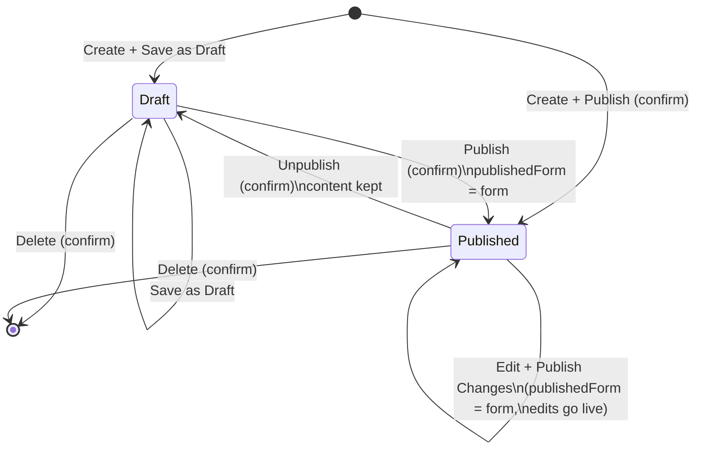

# Dataset Module — Product Reference (PRD)

> **What this is.** A reference description of how the **Datasets** module of the
> CivicDataSpace contributor prototype is built and why — the list table, the
> creation/edit wizard, every field in every step, the lifecycle rules, file
> handling, cross‑module links, and the copy shown to users.
>
> **Status.** Describes the code as it stands on `main` (working tree, 2026‑09).
> This is a **front‑end prototype**: all data lives in React state seeded from
> mock fixtures, there is no backend, and a few integration points are simulated
> (flagged as **[MOCK]** below).

---

## 1. Purpose & scope

The Datasets module lets a contributor **publish civic data** to CivicDataSpace.
A "dataset" is a titled, described, classified bundle of one or more **data
files** (uploaded directly or imported from a public platform), plus publishing
settings (access type + licence). Once published it is publicly discoverable and
can be **referenced by** Events, Use Cases and Charts.

The module has two surfaces:

| Surface | Component | Entry |
|---|---|---|
| **My Datasets** list | `DatasetListView` → `ManagementTable` | `/dashboard/datasets` |
| **Dataset creation / edit** wizard | `DatasetCreationFlow` (`variant="page"`) | "Add Dataset", a table row, or the dashboard "Continue Working" queue |
| **Contextual "Add Dataset"** mini‑wizard | `DatasetCreationWizard` | inside Event creation → "Connect datasets" (`DatasetConnectionsCard`) |

`DatasetsPage` owns the toggle between `list` and `create` views and passes nav
state (`{ datasetId }`) through from other pages.

---

## 2. Vocabulary & core concepts

| Term | Meaning |
|---|---|
| **Dataset record** (`DatasetRecord`) | The stored entity: `id`, `status`, `updatedAt`, `form`, `publishedForm`. |
| **Form** (`DatasetFormState`) | The working copy the contributor is editing: `metadata`, `files`, `resources`. |
| **Published snapshot** (`publishedForm`) | A copy of `form` taken at the moment of the last publish. Untouched while a working copy has unpublished edits, so "discard" can restore the public version. `null` until first publish. |
| **Lifecycle status** (`ContentStatus`) | Exactly two persistent values, platform‑wide: **`draft`** (never public) and **`published`** (public). This is the *only* thing shown in a status badge. |
| **Edit state** | *Separate* from status: **Saved** vs **Unsaved changes**. An editing indicator, never a badge/column. `hasUnsavedEdits(current, lastSaved)` = JSON compare. |
| **Unpublished edits** | A `published` record whose `form` ≠ `publishedForm` — a saved working copy that differs from what the public sees. Drives the dashboard "Continue Working" queue. Never rendered as a badge; resolved only from inside the wizard (publish, or discard on the leave gate). `hasUnpublishedEdits(record)`. |
| **Resource / File** | In the main flow a dataset holds `files` (`DatasetFile[]`). `resources` (`DatasetResource[]`) is **vestigial** — only the contextual mini‑wizard still writes it (CSV/API/Link). The list's file count is `files.length + resources.length`. |

**Key rule (`resolveLifecycle`):** editing never flips `published → draft` and
nothing auto‑publishes. `published → draft` happens **only** via the explicit
**Unpublish** action.

---

## 3. Data model

### 3.1 `DatasetRecord`  (`src/types/dataset.ts`)

| Field | Type | Notes |
|---|---|---|
| `id` | `string` | `dataset-<n>` for new records; mock ids for seeds. |
| `status` | `'draft' \| 'published'` | Lifecycle status. |
| `updatedAt` | `string` | `"DD/MM/YYYY HH:mm:ss"` (see `formatTimestamp`). Bumped on every upsert / unpublish. |
| `form` | `DatasetFormState` | The current working copy. |
| `publishedForm` | `DatasetFormState \| null` | Snapshot at last publish; `null` if never published. |

### 3.2 `DatasetFormState`

| Field | Type | Notes |
|---|---|---|
| `metadata` | `DatasetMetadata` | Step 2 fields. |
| `files` | `DatasetFile[]` | Step 1 output (uploads + platform imports). |
| `resources` | `DatasetResource[]` | Vestigial in the main flow — always `[]` for anything created through the current wizard. Still written by `DatasetCreationWizard`. |

### 3.3 `DatasetMetadata`

| Field | Type | Required? | UI control | Review label |
|---|---|---|---|---|
| `name` | `string` | **Yes** | text input | Dataset Name |
| `description` | `string` | **Yes** | textarea (4 rows) | Description |
| `sector` | `string` (option value) | **Yes** | `SearchableSelect` | Sector |
| `geography` | `string` (option value) | No | `SearchableSelect` | Geography |
| `tags` | `string[]` | No | `TagInput` (Enter to add) | Tags |
| `sourceWebsite` | `string` | No | text input | Source Website |
| `createDate` | `string` (`yyyy-mm-dd`) | No | native date input | Create Date |
| `accessType` | `'open' \| 'restricted' \| ''` | **Yes** | radio card group | Access Type |
| `license` | `string` (option value) | **Yes** | `SearchableSelect` | License |

### 3.4 `DatasetFile`

| Field | Type | Origin | Editable by user? |
|---|---|---|---|
| `id` | `string` | generated (`file-<n>-<name>` / `import-<n>-<name>`) | no |
| `name` | `string` | the physical uploaded/remote filename | **no** (never edited) |
| `title` | `string?` | `deriveDefaultResourceTitle(name)` by default | **yes** (row inline edit + File Details) |
| `description` | `string?` | `deriveFileDescription(file)` by default | **yes** (File Details) |
| `extension` | `string` (upper‑case) | parsed from filename | no |
| `sizeLabel` | `string` | `formatFileSize(bytes)` → e.g. `4.2MB` | no |
| `sizeBytes` | `number` | actual file size / mock | no |
| `uploadedAt` | `string` | `formatTimestamp(new Date())` at add time | no |
| `source` | `string?` | `'File upload'`, or `'Kaggle' \| 'GitHub' \| 'Hugging Face'` | no |
| `path` | `string?` | folder path within a platform import (e.g. `data/raw`) | no |
| `importUrl` | `string?` | the platform dataset/repo URL | no |
| `rowCount` | `number?` | CSV/TSV shape inference (uploads ≤ 5 MB) or mock (imports) | **yes** in File Details… *(see note)* |
| `columnCount` | `number?` | as above | **yes** in File Details… *(see note)* |

> *Note:* the File Details sheet renders row/column counts through `InferredField`
> as **read‑only** ("Read from the file — not editable"). The type allows editing
> but the current UI does not expose it. Only **Title** and **Description** are
> editable there.

### 3.5 Derivations (`src/lib/file-validation.ts`)

- **`deriveDefaultResourceTitle(name)`** — strip extension, split on space/`_`/`-`,
  capitalise purely‑lowercase words only (acronyms like `GDP`, tokens like `v3`
  left as‑is). `getResourceTitle(file)` returns `file.title` or this fallback.
- **`deriveFileDescription(file)`** — tabular (`CSV/TSV/XLS/XLSX`) with a known
  shape → `"CSV data file with 45,211 rows and 17 columns."`; tabular without a
  shape → `"CSV data file."`; `PDF` → `"PDF document."`; `TXT` → `"Plain-text
  file."`; otherwise `"<EXT> file."`. `getResourceDescription(file)` returns
  `file.description` or this fallback.
- **`inferCsvShape(File)`** — client‑side, CSV/TSV only, **only if the file is
  ≤ 5 MB**; counts non‑blank lines (− 1 for header) and first‑line delimiter
  splits. Returns `{}` when it can't tell. Never fabricated.

---

## 4. My Datasets — the list table

Rendered by `DatasetListView` configuring the shared **`ManagementTable`**
(`src/components/shared/management-table/ManagementTable.tsx`).

### 4.1 Header

- **Title:** "My Datasets"
- **Subtitle:** `"{N} dataset(s) · manage published datasets and continue drafts"`
- **Primary action:** **Add Dataset** button → new wizard at step 1.

### 4.2 Columns

| # | Key | Label | Width | Shown | Sortable | Renders |
|---|---|---|---|---|---|---|
| 1 | `name` | Dataset | flexible, **min 12rem** | always | yes (locale) | `FileText` icon + truncated name; click opens the dataset |
| 2 | `sector` | Sector | 8.125rem | ≥ `lg`, optional | yes | sector label or `—` |
| 3 | `geography` | Geography | 8.125rem | ≥ `lg`, optional | no | geography label or `—` |
| 4 | `files` | Files | 5.625rem | ≥ `lg`, optional | yes | `"{count} file(s)"`, `count = files + resources` |
| 5 | `status` | Status | 6.875rem | optional | no | `StatusBadge` (Draft / Published) |
| 6 | `updated` | Last Updated | 8.125rem | ≥ `md`, optional | yes | `formatShortDate` → `"09 Aug 2026"` |

- **Default sort:** `updated`, **descending**.
- **Optional** columns can be toggled via the **Columns** control; `responsive`
  columns also auto‑hide below their breakpoint regardless of the toggle.
- Below the summed minimum width the whole table body scrolls horizontally.
- Row geometry tokens: header 48px, rows 48–72px (≈ 56px typical), footer 56px.

### 4.3 Status tabs

`All` · `Draft` · `Published`, each with a live count. Switching a tab resets to
page 1. Per‑tab empty copy: Draft → "No drafts yet."; Published → "No published
content yet."

### 4.4 Search

Placeholder "Search datasets…". `searchMatch` builds a lowercase haystack from
**name + tags + sector label + geography label** and does a substring test.
Typing resets to page 1.

### 4.5 Filters

Multi‑select (`MultiSelectFilter`), selected values float to the top:

| Filter | Options | Match |
|---|---|---|
| Sector | `SECTOR_OPTIONS` | `metadata.sector === value` |
| Geography | `GEOGRAPHY_OPTIONS` | `metadata.geography === value` |

Semantics: **OR** within one filter's selected values, **AND** across filters.
"Clear filters" resets all. Active‑filter count shown on the control.

### 4.6 Pagination

`PAGE_SIZE = 10`. Page clamps to the available total; any tab/search/filter/sort
change resets to page 1.

### 4.7 Row interactions

**Click a row / the name:**
- `draft` → **edit** (opens wizard at **step 1**)
- `published` → **view** (opens wizard at **step 3**, Review)

**Row actions (kebab / trailing buttons):**

| Status | Actions |
|---|---|
| `draft` | **Continue editing** (`Pencil` → step 1) · **Delete** (`Trash2`, destructive) |
| `published` | **Edit** (`Pencil` → step 1) · **Unpublish** (`Archive`, destructive) |

### 4.8 Empty state (no datasets at all)

"No datasets yet" / "Create your first dataset to make civic data available." +
an **Add Dataset** button.

### 4.9 Delete & Unpublish confirmations (`DatasetsPage`)

**Delete** — `confirm({ title: "Delete dataset?", confirmLabel: "Delete Dataset",
variant: "destructive" })`:
- if connected to N events → *""{name}" is connected to {N} event(s). Deleting it
  will remove the dataset from those connections. This action cannot be undone."*
- else → *"Deleting "{name}" will permanently remove it from My Workspace. This
  action cannot be undone."*
- on confirm: `deleteDataset(id)` + toast **"Dataset deleted"**.

**Unpublish** — `confirm({ title: "Unpublish this dataset?", confirmLabel:
"Unpublish", variant: "destructive" })`, body *""{name}" will be removed from
public view and moved back to Draft. You can continue editing and publish it
again later."* → `unpublishDataset(id)` + toast **"Dataset unpublished" / "Moved
back to Draft."** Content (`form`, `publishedForm`) is **kept**; only `status`
and `updatedAt` change.

---

## 5. Creation & edit flow — `DatasetCreationFlow`

### 5.1 Entry points

| From | Effect |
|---|---|
| **Add Dataset** (list) | new dataset, `datasetId = null`, start at step 1 |
| **Row: edit / continue editing** | `datasetId = id`, start at **step 1** |
| **Row click on a published dataset** | `datasetId = id`, start at **step 3** (Review) |
| **Dashboard → "Continue Working"** | navigates with `{ datasetId }`; opens at step 1 |
| `variant="drawer"` | a right‑side slide‑over version of the same wizard — **currently not mounted anywhere**; contextual creation uses the separate `DatasetCreationWizard` (§9). |

### 5.2 Wizard shell (page variant)

Top‑to‑bottom inside a `Card`:

1. **`WorkspaceHeader`** — Close (X) button, title (`"New Dataset"` for a new
   record, else `metadata.name || "Untitled Dataset"`; *not* inline‑editable in
   this flow), and a right‑side indicator:
   - **"Unsaved changes"** chip (warning) — only when the dataset **has a live
     published version** *and* the working copy differs from the last save
     (`showUnsavedIndicator = hasLiveVersion && hasUnsavedChanges`).
   - otherwise **"All changes saved" / "Saving…"** pill.
   > The "Saving…/saved" pill is a **700 ms visual debounce** on `form` edits.
   > It does **not** persist anything. Real persistence happens only on **Save as
   > Draft / Save Changes** or **Publish**. (Prototype behaviour — no autosave.)
2. **Public‑visibility badge** (`PublicVisibilityBadge`) — "Public visibility ·
   Public once published", or "· Live on CivicDataSpace" if already published.
3. **`Stepper`** — 3 steps. Progress‑only until the user reaches **step 3 with
   metadata valid**, then `stepperUnlocked` latches `true` and every step becomes
   clickable (revisit completed steps). Never re‑locks.
4. **Step body** (see §6–8).
5. **`WizardFooter`** — `Previous` (steps 2–3) · `Save as Draft` /
   `Save Changes` (always) · `Continue` (steps 1–2).

### 5.3 Steps

| Display order | Label (stepper) | Component rendered | Help label |
|---|---|---|---|
| 1 | **Data Files** | `Step2DataFiles` | "Resources" |
| 2 | **Metadata** | `Step1Metadata` | "Metadata" |
| 3 | **Review & Publish** | `Step3Review` | "Review" |

> The component **file names are legacy** (metadata used to be first). The live
> order is **Data Files → Metadata → Review**. `Step3Review`'s `onEditStep`
> mapping: `1 = Data Files`, `2 = Metadata`.

### 5.4 Leaving with unsaved changes

Closing (X) when `hasUnsavedChanges` opens **`LeaveCreationDialog`**
(`itemLabel="dataset"`):
- **Save** → `handleSaveDraft()` then close
- **Discard** → close without saving (in‑memory working copy dropped; the
  persisted record keeps its last saved state)
- **Cancel** → stay

### 5.5 Save behaviour (`handleSaveDraft` → `saveWorkingCopy`)

`upsertDataset(editingId, 'draft', form)` — persists the working copy **without
changing status**:

| Record state | Result | Toast | Footer label |
|---|---|---|---|
| new / still draft | stays **draft** | "Dataset saved as Draft" / "It is not publicly available yet." | **Save as Draft** |
| already published | stays **published**, `publishedForm` untouched → now has **unpublished edits** | "Changes saved" / "Your edits aren't published yet. The current published version stays live." | **Save Changes** |

### 5.6 Publish behaviour (`handlePublish` → `publishNow`)

1. If metadata invalid → `showMetadataErrors = true`, jump to **step 2**. (Files
   are **not** required — see §7.4.)
2. Confirm dialog:
   - new: *"Publish dataset?"* — *"You're about to publish "{name}". Once
     published, this dataset will be available in the public repository."* —
     confirm **Publish Dataset**
   - has live version: *"Publish changes?"* — *"Your changes to "{name}" will
     replace the current published version immediately."* — confirm **Publish
     Changes**
3. `upsertDataset(editingId, 'published', form)` → status `published`,
   `publishedForm = form`.
4. Feedback:
   - new → **`PublishSuccessModal`** (§8.5)
   - has live → toast "Changes published" / "Your changes are now live on
     CivicDataSpace."

---

## 6. Step 1 — Data Files  (`Step2DataFiles`)

A segmented control switches between two **methods**:

### 6.1 Method A — File Upload

- **Control:** `DropzoneUploadField` (drag‑and‑drop + browse), `multiple`.
- **Accepted:** `SUPPORTED_FILE_EXTENSIONS = pdf, csv, xls, xlsx, txt`
  (extension badges shown).
- **Size limit:** `MAX_FILE_SIZE_BYTES = MAX_DOCUMENT_BYTES = 500 MB`
  (hint: "Maximum file size limit: 500 MB").
- **Validation** (`validateIncomingFiles`), per file, first error also toasted:
  | Case | Message |
  |---|---|
  | duplicate filename (case‑insensitive, vs existing) | `"{name}: This file has already been added."` |
  | unsupported extension | `"{name}: This file type isn't supported. Upload PDF, CSV, XLS, XLSX or TXT."` |
  | over 500 MB | `"{name}: File exceeds the 500 MB size limit."` |
- **On accept:** each file gets `source: 'File upload'`, an auto `title`
  (`deriveDefaultResourceTitle`), `uploadedAt = now`; CSV/TSV ≤ 5 MB also get
  `rowCount` / `columnCount` via `inferCsvShape`.
- **Name suggestion:** if this is the first file added *and* `metadata.name` is
  empty, the dataset name is pre‑filled from `getResourceTitle(firstFile)`.
- Success toast: "File uploaded" / "Files uploaded" (`{n} files have been added.`).

### 6.2 Method B — Public Platform  **[MOCK integration]**

Import files from **Kaggle / GitHub / Hugging Face** (`src/lib/platform-import.ts`).

1. **Select Platform** (`SearchableSelect`, required).
2. **Dataset URL** (required, appears after platform chosen) — per‑platform
   placeholder + help text:
   | Platform | Placeholder | Host check |
   |---|---|---|
   | Kaggle | `https://www.kaggle.com/datasets/owner/dataset-name` | `*.kaggle.com` |
   | GitHub | `https://github.com/owner/repository` | `*.github.com` |
   | Hugging Face | `https://huggingface.co/datasets/owner/dataset-name` | `*.huggingface.co` |
   URL errors (`validatePlatformUrl`): `empty` → "Enter the dataset URL.";
   `malformed` → "Enter a valid URL starting with http:// or https://.";
   `wrong-platform` → "This URL doesn't look like a {Platform} dataset. Paste a
   {Platform} link, or switch the platform above."
3. **Extract Dataset** button (`Sparkles`); while running shows a spinner
   ("Extracting dataset files…").
4. **`extractDatasetFromPlatform` [MOCK]** — simulated delay, then realistic
   per‑platform mock file listings. Kaggle listings are flat; GitHub / Hugging
   Face carry folder `path`s. **Fails** when the URL doesn't point at a specific
   dataset/repo, or contains the word `fail` (a deliberate demo hook) →
   red error panel + "Extraction failed" toast.
5. **On success:** new files (deduped by `path + name`) get `source =` platform
   label, `path`, `importUrl`, mock `rowCount`/`columnCount`, and a derived
   `title`. Toast: "Dataset extracted successfully" (`{n} file(s) added.`), or
   "Already imported" if every file was a duplicate.

> **This is the single integration seam.** Swap the body of
> `extractDatasetFromPlatform` for a real service; every downstream UI state
> keeps working. No network calls exist today.

### 6.3 Uploaded Files list

Card header: **"Uploaded Files ({N})"** + a "{N} File(s) Ready" indicator.
Files with a `path` are **grouped by folder** (folder label + left rule); flat
otherwise. Each **`FileRow`** shows:

- success check · **title** (inline‑editable via a pencil → input; Enter commits,
  Esc cancels, empty reverts)
- meta line: extension badge · `Size: {sizeLabel}` · `Uploaded|Imported:
  {uploadedAt}` · `Original: {name}` · `Source: {source}` (platform only)
- a green **"Ready"** badge
- **View details** (`Eye`) → File Details sheet
- **Delete** (`Trash2`) → removes the file + toast "File removed"

Empty: "No files uploaded yet."

### 6.4 File Details side sheet (`FileDetailsSheet`) — right drawer

Shared by uploads and platform imports.

**Editable:**
| Field | Control | Notes |
|---|---|---|
| Title | input | commits on blur / Enter; empty reverts |
| Description | textarea (3 rows) | seeded from `getResourceDescription` (system summary); helper: "Starts from a system‑generated summary — edit it to add context." |

**Read‑only — "Read from the file — not editable"** (`InferredField`, fallback
"Unable to determine" / "We couldn't read this information from the file."):
File type · File size · Number of rows · Number of columns · Source ·
Uploaded/Imported date · Original filename · Folder path *(if any)* ·
Imported from *(link, if `importUrl`)*.

**Footer:** **Preview** / **Preview table** (tabular exts `CSV, XLS, XLSX, TSV`)
→ `ResourcePreviewDialog`; **Close**.

---

## 7. Step 2 — Metadata  (`Step1Metadata`)

Four cards. `*` = required (`validateMetadata`).

### 7.1 Basic Information
| Field | Control | Placeholder / help | Error message |
|---|---|---|---|
| **Dataset name\*** | input | "e.g. Municipal Expenditure Budget 2024" | "Enter a dataset name." |
| **Description\*** | textarea (4 rows) | "Describe what this dataset contains, its purpose, time range covered…" | "Enter a description." |

### 7.2 Classification
| Field | Control | Help | Error |
|---|---|---|---|
| **Sector\*** | `SearchableSelect` (`SECTOR_OPTIONS`) | "Search and select a sector…" | "Select a sector." |
| Geography | `SearchableSelect` (`GEOGRAPHY_OPTIONS`) | "Search and select geography…" | — |
| Tags | `TagInput` | "Press Enter to add. Tags improve discoverability." | — |

### 7.3 Source Information *(both optional)*
| Field | Control | Placeholder |
|---|---|---|
| Source website | input | "http://data.city.name.gov/dataset" |
| Dataset creation date | native `date` input | "dd/mm/yyyy" |

### 7.4 Publishing Settings
| Field | Control | Options | Error |
|---|---|---|---|
| **Access type\*** | radio‑card group | **Open Access** ("Anyone can browse and download") · **Restricted Access** ("Requires approval to access") | "Select an access type." |
| **License\*** | `SearchableSelect` (`LICENSE_OPTIONS`) | see §10 | "Select a license." — helper when valid: "CC BY 4.0 is recommended for open government data." |

> **Required to publish:** `name`, `description`, `sector`, `accessType`,
> `license`. **Files are *not* validated** — a dataset with zero files can be
> published. `geography`, `tags`, `sourceWebsite`, `createDate` are optional.

---

## 8. Step 3 — Review & Publish  (`Step3Review`)

### 8.1 Review sections (collapsible `ReviewSection`, all open by default)

| Section | Edit → | Fields shown |
|---|---|---|
| **Metadata** | step 2 | Dataset Name, Description, Sector, Geography, Tags (accent chips), Source Website, Create Date |
| **Publishing Settings** | step 2 | Access Type ("Open Access" / "Restricted Access"), License (label) |
| **Uploaded Files** | step 1 | per file: check · title · ext badge · size · date · `Original: {name}` · **Preview** (`Eye`). Footer: **"Total file size: {sum}"** |

### 8.2 Cross‑reference sections (only when the dataset is already saved, `datasetId` set)

- **Charts** — published charts with `chart.form.datasetId === datasetId`; shows
  chart name + type badge.
- **Used in** — published **Events** (`event.form.relatedContent.datasets`) and
  published **Use Cases** (`useCase.form.connections.datasets`) that reference
  this dataset. Shows up to `USED_IN_VISIBLE_LIMIT = 5`, then "+{n} more".

### 8.3 Public‑visibility notice (`PublicVisibilityNotice`)

- new: "Once published, this dataset will be publicly available on
  CivicDataSpace… Before publishing, make sure you have permission to share all
  included information and that it does not contain private or restricted
  content."
- has live version: "This dataset is already public. Changes you publish will
  replace the current public version immediately."

### 8.4 Publish panel (`ReviewPublishPanel`)

- Button label: **Publish Dataset** (new) / **Publish Changes** (has live).
- **Disabled** while `!canPublish` (metadata invalid), with the hint "Complete
  the required fields in Metadata before publishing."
- Lead copy: "Your dataset will be publicly available immediately after
  publishing." / "Publishing will replace the current public version of this
  dataset immediately."

### 8.5 `PublishSuccessModal` (new dataset, page variant)

- Heading "Dataset published" · *""{name}" is now indexed in the public
  repository."*
- Two copy‑to‑clipboard fields **[MOCK values]**:
  - **DOI** — `10.5072/DATASPHERE-2026-US-89421`
  - **REST Query API Endpoint** — `https://api.data.gov/v1/datasets/ds_89421/query`
- Actions: **View in My Workspace** (closes to list) · **Create Another Dataset**
  (resets the wizard to a fresh step 1).

---

## 9. Contextual "Add Dataset" mini‑wizard — `DatasetCreationWizard`

Used **inside Event creation** via `DatasetConnectionsCard` ("Connect
datasets" → "Create new"). A right‑drawer dialog, **not** the 3‑step flow.

Three cards:

| Card | Fields | Required |
|---|---|---|
| **Resource** | one of: **CSV** upload (`.csv` only) · **API** URL · **Link** URL. "Add at least one resource." | ≥ 1 resource |
| **Dataset Details** | name, description, sector | all three |
| **License & Access** | license, access type ("visibility") | both |

- Validation via `mini-dataset-validation.ts` (name/description/sector;
  ≥ 1 resource; license + accessType).
- Name suggestion from the first CSV resource's derived title.
- Close with any field touched → `confirm("Discard changes?", "Discard",
  destructive)`.
- **On submit:** `upsertDataset(null, 'published', form)` — always creates a
  **published** dataset immediately, with `files: []` and the entered
  `resources`. Then calls `onCreated(id, name)` so the Event connects it.
- This is the **only path that still writes `DatasetFormState.resources`**.

---

## 10. Option lists  (`src/types/dataset.ts`)

**`SECTOR_OPTIONS`** — Agriculture, Education, Energy, Environment, Finance,
Health, Housing, Transportation, Urban Development, Water & Sanitation.

**`GEOGRAPHY_OPTIONS`** — India, Bangladesh, Nepal, Sri Lanka, Pakistan, Bhutan,
Global.

**`LICENSE_OPTIONS`** — CC BY 4.0 (`cc-by-4.0`) · CC BY‑SA 4.0 (`cc-by-sa-4.0`) ·
CC0 1.0 Public Domain (`cc0-1.0`) · Open Data Commons Attribution (`odc-by`) ·
Government Open Data License – India (`gov-ogd-india`) · Other (`other`).

**File constants** — `SUPPORTED_FILE_EXTENSIONS = ['pdf','csv','xls','xlsx','txt']`
· `MAX_FILE_SIZE_BYTES = 500 MB` · CSV shape inference cap `5 MB` ·
list `PAGE_SIZE = 10`.

---

## 11. Lifecycle — state & transitions

### 11.1 The two axes

1. **Status** (persisted, badge): `draft` → `published`. Only **Unpublish**
   goes back.
2. **Edit state** (transient indicator): `Saved` ⇄ `Unsaved changes`
   (working copy vs last save). For a **published** record a saved‑but‑not‑
   published working copy is called **unpublished edits** and feeds the
   dashboard "Continue Working" queue.

### 11.2 `resolveLifecycle(existing, intent, form)`

| intent | existing status | → status | → publishedForm |
|---|---|---|---|
| `save` | none / draft | `draft` | carried through (usually `null`) |
| `save` | published | `published` | **unchanged** (public version stays) |
| `publish` | any | `published` | **replaced with `form`** |

Never flips `published → draft`; never auto‑publishes.

### 11.3 Transition map

### 11.4 Store operations (`AppDataContext`)

| Function | Effect |
|---|---|
| `upsertDataset(id \| null, status, form)` | new id `dataset-<n>` if none; runs `resolveLifecycle`; new records **prepended**; bumps `updatedAt`; returns the id. |
| `unpublishDataset(id)` | `status = 'draft'`, bump `updatedAt`. `form` / `publishedForm` untouched. |
| `deleteDataset(id)` | removes the record. No cascade — Events/Use Cases keep the dead id in their connection arrays; the delete **confirm** just warns about connected events. |

Data is **in‑memory React state** seeded from `MOCK_DATASETS` on every load
(with a cross‑tab `storage` listener). No backend, no real persistence.

---

## 12. Cross‑module relationships

| Consumer | Link field | Shown back in the dataset as |
|---|---|---|
| **Event** | `form.relatedContent.datasets: {id}[]` | Review → "Used in" (if published) |
| **Use Case** | `form.connections.datasets: {id}[]` | Review → "Used in" (if published) |
| **Chart** | `form.datasetId` | Review → "Charts" (if published) |

- Deleting a dataset that Events reference triggers the "connected to N events"
  warning but does **not** rewrite those Events.
- The contextual mini‑wizard (§9) both **creates** a dataset and **connects** it
  to the Event in one action.

---

## 13. Copy reference (toasts & lifecycle messages)

| Trigger | Title / description |
|---|---|
| Save draft (new/draft) | "Dataset saved as Draft" / "It is not publicly available yet." (`datasetLifecycleMessage('draft')`) |
| Save changes (published) | "Changes saved" / "Your edits aren't published yet. The current published version stays live." |
| Publish changes (published) | "Changes published" / "Your changes are now live on CivicDataSpace." |
| Publish (new) | `PublishSuccessModal` — "Dataset published" |
| Delete | "Dataset deleted" |
| Unpublish | "Dataset unpublished" / "Moved back to Draft." |
| File upload ok | "File uploaded" / "Files uploaded" |
| File upload fail | "File upload failed" / *(first validation error)* |
| File removed | "File removed" |
| Platform extract ok | "Dataset extracted successfully" / "{n} file(s) added." |
| Platform extract fail | "Extraction failed" / *(error)* |
| Platform, all dupes | "Already imported" / "Those files are already in this dataset." |
| Copy DOI / endpoint | "Copied to clipboard" / (fail) "Unable to copy" |

---

## 14. Prototype boundaries — what is real vs simulated

| Area | Status |
|---|---|
| List, wizard, validation, file upload, CSV shape inference, folder grouping, File Details, review, lifecycle rules | **Real** front‑end logic. |
| Platform import (`extractDatasetFromPlatform`) | **[MOCK]** — simulated delay + fixture listings. The single seam for a real ingestion service. |
| Published DOI + REST API endpoint | **[MOCK]** — constant strings in `PublishSuccessModal`. |
| Data persistence | **In‑memory** React state from `MOCK_DATASETS`; no backend, no DB, cross‑tab only. |
| "All changes saved" indicator | **Cosmetic** 700 ms debounce; not an autosave. |
| `DatasetFormState.resources` | **Vestigial** in the main flow; only `DatasetCreationWizard` writes it. |
| `ManagementTable` `loading` / `loadError` / `onRetry` | Defined but never triggered (synchronous mock data). |
| `DatasetCreationFlow` `variant="drawer"` | Implemented but **not mounted** anywhere today. |

---

## 15. File map

| File | Responsibility |
|---|---|
| `src/pages/DatasetsPage.tsx` | list ⇄ create view switch; delete / unpublish confirms; nav‑state plumbing |
| `src/components/dataset/DatasetListView.tsx` | `ManagementTable` config: columns, filters, tabs, row actions |
| `src/components/shared/management-table/ManagementTable.tsx` | the shared list table (tabs, search, filters, sort, columns toggle, pagination, empty/loading states, responsive) |
| `src/components/dataset/DatasetCreationFlow.tsx` | wizard shell, step routing, save/publish, stepper unlock, leave gate, success feedback |
| `src/components/dataset/Step2DataFiles.tsx` | **Step 1 – Data Files**: upload / platform import, file list, folder grouping |
| `src/components/dataset/Step1Metadata.tsx` | **Step 2 – Metadata**: the four metadata cards |
| `src/components/dataset/Step3Review.tsx` | **Step 3 – Review & Publish**: review sections, Charts / Used‑in, publish panel |
| `src/components/dataset/FileDetailsSheet.tsx` | per‑file drawer: editable title/description + read‑only inferred facts |
| `src/components/dataset/WorkspaceHeader.tsx` | wizard header: close, title, saved / unsaved indicator |
| `src/components/dataset/WizardFooter.tsx` | Previous / Save / Continue bar |
| `src/components/dataset/PublishSuccessModal.tsx` | post‑publish modal (DOI + API endpoint) |
| `src/components/dataset/PublicVisibilityNotice.tsx` | `PublicVisibilityBadge` + `PublicVisibilityNotice` |
| `src/components/event/DatasetCreationWizard.tsx` | contextual mini‑wizard (Resource / Details / License) — always publishes |
| `src/components/shared/DatasetConnectionsCard.tsx` | Event‑side "connect / create dataset" surface |
| `src/types/dataset.ts` | all types + option lists + constants |
| `src/lib/content-status.ts` | `ContentStatus`, `hasUnsavedEdits`, `hasUnpublishedEdits`, `resolveLifecycle` |
| `src/lib/dataset-lifecycle-messages.ts` | canonical save/publish copy |
| `src/lib/validation.ts` | `validateMetadata` / `isMetadataValid` (full flow) |
| `src/lib/mini-dataset-validation.ts` | validation for the contextual mini‑wizard |
| `src/lib/file-validation.ts` | file accept/dedupe/size checks, title & description derivation, CSV shape inference |
| `src/lib/platform-import.ts` | **[MOCK]** platform import: options, URL validation, `extractDatasetFromPlatform` |
| `src/lib/generic-upload.ts` | shared upload constants (`MAX_DOCUMENT_BYTES` = 500 MB) + `formatUploadLimit` |
| `src/lib/format.ts` | `formatFileSize`, `formatTimestamp`, `parseAppTimestamp`, `formatShortDate` |
| `src/context/AppDataContext.tsx` | `datasets` state + `upsertDataset` / `unpublishDataset` / `deleteDataset` |
| `src/lib/mock-datasets.ts` | seed data |
